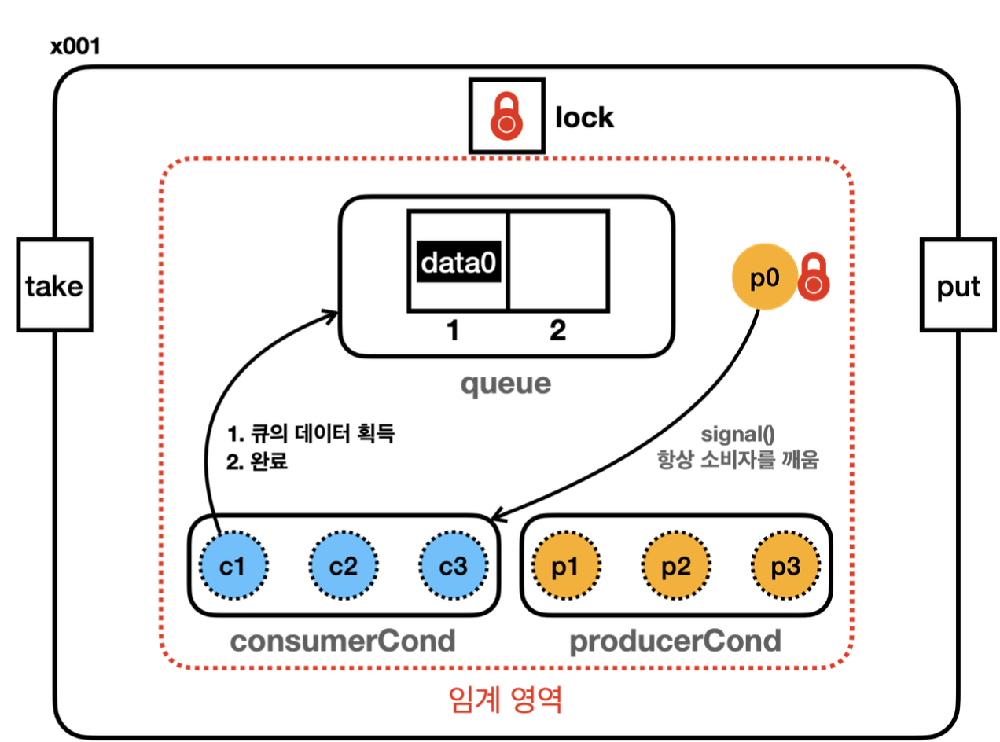
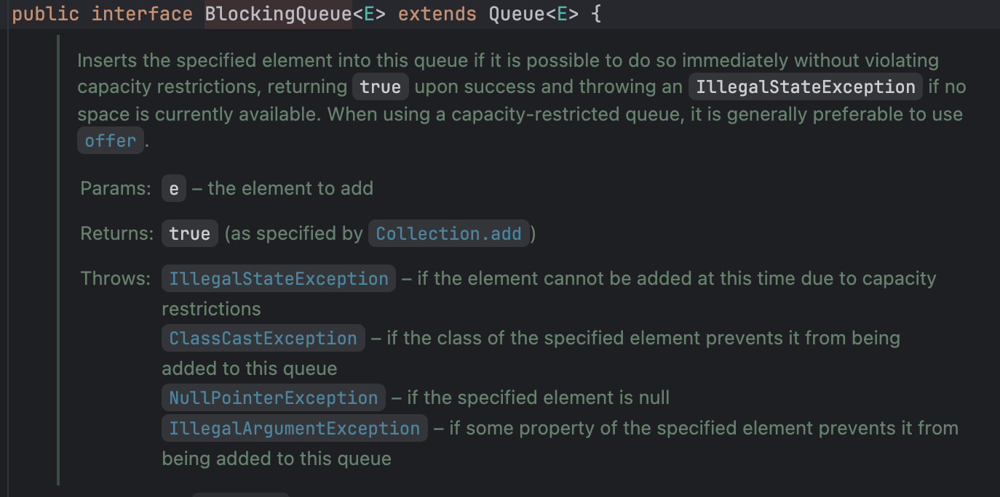
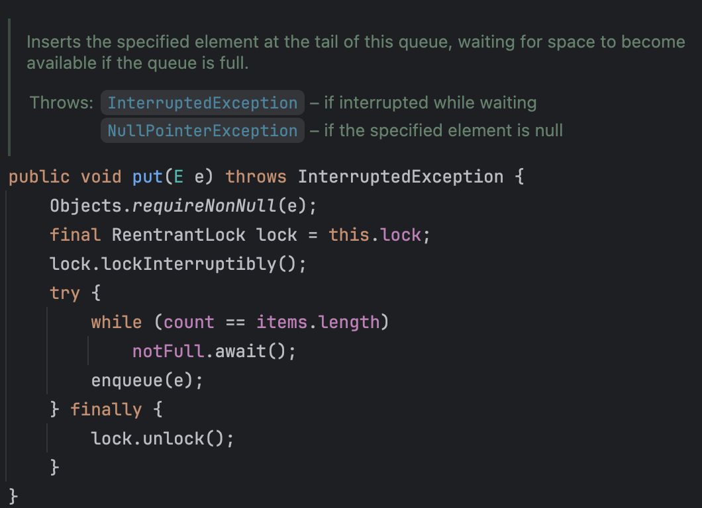
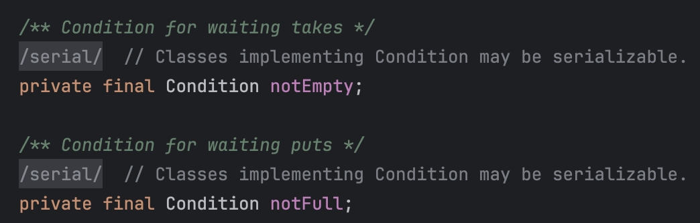

# 10장 - 생산자 소비자 문제 2

### 10장에서는 이전 9장에서 진행한 비효율적인 문제를 개선한다

### 목차

1. [해결과정 - v4](#생산자-소비자-문제-예제-코드-진행---v4)
2. [해결과정 - v5](#생산자-소비자-문제-예제-코드-진행---v5)
3. [BlockingQueue?](#blockingqueue)
4. [해결과정 - BlockingQueue 적용](#blockingqueue-적용)
5. [정리](#이번-장을-진행하며-정리)

### 기존 코드의 문제점

기존 v3까지 진행을 하며 문제점은 notifyAll()을 통해 모든 스레드가 깨워져 임시 방편으로 해결을 했지만 소비자 스레드가 다시 소비자 스레드를 깨울 경우, 생산자 스레드가 다시 생산자 스레드를 꺠울경우 비효율적인 상황이 발생한다

그렇다면 생산자 스레드는 데이터를 생성하고 소비자 스레드를 깨울 방법이 없을까?

# 생산자 소비자 문제 예제 코드 진행 - v4

> 기존의 synchronized 사용 대신 ReentrantLock 구현체를 사용해 똑같이 만들어 보자

```java
public class BoundedQueueV4 implements BoundedQueue {

    private final Lock lock = new ReentrantLock();
    private final Condition condition = lock.newCondition();
    ...

@Override
public void put(String data) {
    lock.lock();
    try {
        while (queue.size() == max) {
            log("[put] 큐가 가득 참, 생산자 대기");
            try {
                condition.await(); //wait()를 쓰면 안된다 wait는 모든 객체가 사용하는 메서드
                log("[put] 생산자 깨어남");
            } catch (InterruptedException e) {
                throw new RuntimeException(e);
            }
        }
        queue.offer(data);
        log("[put] 생산자 데이터 저장, notify() 호출");
        condition.signal();
    } finally {
        lock.unlock();
    }
}
```

- ReentrantLock을 사용할 경우 스레드를 대기 시킬 공간이 필요하다
- Condition을 통해 스레드가 대기하는 스레드 대기 공간을 만든다

### Condition

- `Condtion condition = lock.newCondtion();`
- Condition은 ReentrantLock을 사용하는 스레드가 대기하는 스레드 대기 공간
- 기존에는 객체가 가지고있던 Object.wait()를 통해서 스레드 대기 공간을 사용했지만
- ReentrantLock에서는 Condition을 통해서 스레드 대기 공간을 직접 만들어줘야 한다

### condition.await()

- condition에 현재 스레드를 대기(WAITING) 상태로 보관한다

### condition.signal()

- condtion에서 대기중인 스레드를 하나 깨운다
- Object.notify()와 유사한 기능이다

### Object.notify() vs Condition.signal()

- Object.notify()
  - 대기 중인 스레드 중 임의의 하나를 선택해서 깨운다
  - 순서가 정의되어 있지 않다
  - synchronized 블록 안에서 모니터 락을 가지고 있는 스레드가 호출해야 한다
- Condition.signal()
  - 대기 중인 스레드 중 하나를 깨우며 **일반적으로 FIFO 순서로 깨운다**
  - Condition의 구현은 Queue 구조를 사용하기 때문에 일반적으로 FIFO 순서 이다
  - ReentrantLock을 가지고 있는 스레드가 호출해야 한다

# 생산자 소비자 문제 예제 코드 진행 - v5

<p align="left">
    
</p>

```java
public class BoundedQueueV5 implements BoundedQueue {

    private final Lock lock = new ReentrantLock();
    private final Condition producerCond = lock.newCondition();
    private final Condition consumerCond = lock.newCondition();
    ...
    @Override
    public void put(String data) {
        lock.lock();
        try {
            while (queue.size() == max) {
                log("[put] 큐가 가득 참, 생산자 대기");
                try {
                    producerCond.await(); //wait()를 쓰면 안된다 wait는 모든 객체가 사용하는 메서드
                    log("[put] 생산자 깨어남");
                } catch (InterruptedException e) {
                    throw new RuntimeException(e);
                }
            }
            queue.offer(data);
            log("[put] 생산자 데이터 저장, signal() 호출");
            consumerCond.signal();
        } finally {
            lock.unlock();
        }
    }
```

> 기존 v4에서 생산자스레드가 작업을 마친뒤 소비자 스레드를 깨우고, 소비자 쓰레드는 생산자 스레드를 깨우게 수정해보자

1. `Condition`(스레드 대기공간)을 생산자 대기공간과 소비자 대기공간으로 분리
2. 생산자가 버퍼에 가득찰 경우 `ProducerCond.await()`에서 대기하며 락 반납
3. 소비자가 작업 후 producerCond.signal()을 통해서 대기 스레드 깨움
4. 대기 상태의 생산자 스레드는 작업을 완료

이를 통해 생산자가 생산자를 깨우기, 소비자가 소비자를 깨우는 비효율적인 상황을 해결하였다

# BlockingQueue

java.util.concurrent.BlockingQueue 라는 특별한 멀티스레드 자료구조이다

우리가 v5에서 진행한 Condition을 2개로 나누고 생산자와 소비자의 await(), signal()기능을 인터페이스로 제공한다!

<p align="left">
    
</p>

BlockingQueue에서는 많은 메서드를 통해 기능을 제공한다

| 동작   | 대기시 예외 | 즉시 응답 | 대기   | 시간 대기          |
| ------ | ----------- | --------- | ------ | ------------------ |
| Insert | add(e)      | offer(e)  | put(e) | offer(e,time,unit) |
| Remove | remove()    | poll()    | take() | poll(time,unit)    |

### 대기시 예외

- add(e) : 지정된 데이터를 추가, 큐가 가득차면 IllegalStateException 발생
- remove() : 데이터 제거, 큐가 비어있다면 NoSuchElementException 발생

### 즉시 응답

- offer(e) : 지정된 데이터를 추가, 큐가 가득차면 false를 반환
- poll() : 데이터 제거, 큐가 비어있다면 null 반환

### 대기

- put(e) : 데이터 추가할 때까지 대기, 큐가 가득차면 생길때까지 무한 대기
- take() : 데이터 제거, 큐가 비어있다면 채워질 때까지 무한대기

### 시간 대기

- offer(e,time,unit) : ex) offer(data, 1000, TimeUnit.NANOSECONDS); 비워지기 까지 대기하다가 시간이 지나면 false 반환
- poll(time,unit) : 지정된 시간까지 대기하다가 데이터가 없다면 null 반환

# BlockingQueue 적용

```java
public class BoundedQueueV6 implements BoundedQueue{

    private BlockingQueue<String> queue;

    public BoundedQueueV6_1(int max) {
        this.queue = new ArrayBlockingQueue<>(max);
    }

    @Override
    public void put(String data) {
        try {
            queue.put(data);
        } catch (InterruptedException e) {
            throw new RuntimeException(e);
        }
    }

    @Override
    public String take() {
        try {
            return queue.take();
        } catch (InterruptedException e) {
            throw new RuntimeException(e);
        }
    }
```

BlockingQueue 인터페이스를 적용

### BlockingQueue 인터페이스 코드를 살펴보자

<p align="left">
    
</p>

> 우리가 v5에 작성했던 코드와의 차이점이라면 ArrayBlockingQueue의 인터페이스 코드중 put 메서드를 살펴보면 lock.lockInterruptibly()를 사용하여 await()를 통한 대기 상태에서 인터럽트가 가능하게 구현되어 있다

<p align="left">
    
</p>

> BlockingQueue 또한 2개의 Condition 을 사용하여 가득 채워져 있는지 아닌지로 구분하여 사용을 한다

# 이번 장을 진행하며 정리

- v4를 진행하며 스레드 대기 공간인 Condition을 활용하였고 Condition 또한 java.util.concurrent.locks 을 통해 제공해준다
- v5를 진행하며 Condition을 2개로 나누어 생산자,소비자로 구분해서 비효율적인 문제를 개선하였다
- v6를 진행하며 BlockingQueue에 대해 알게되었고 BlockingQueue에서는 다양한 메서드를 제공하기에 상황에 맞게 적절한 메서드를 사용한다
