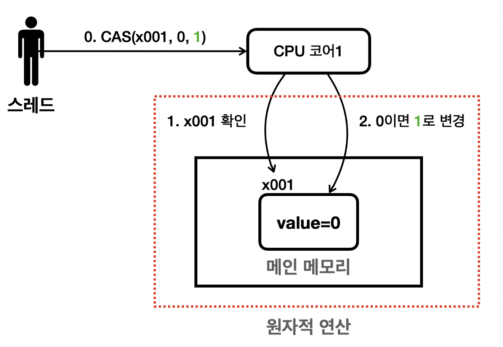

# 11장 - CAS 동기화와 원자적 연산

### 11장에서는 원자적 연산의 개념에 대해 알아보고 CAS에 대해 학습한다

### 목차

1. [원자적 연산?](#원자적-연산atomic-operation)
2. [CAS](#CAS)
3. [CAS 락](#cas-락-구현)
4. [정리](#이번-장을-진행하며-정리)

# 원자적 연산(atomic operation)

- 해당 연산이 더 이상 나눌 수 없는 단위로 수행된다
- 원자적 연산은 중단되지 않고 다른 연산과 간섭 없이 완전히 실행되거나 전혀 실행되지 않는 성질

  `i++` 이 코드는 원자적 연산인가? → 아니다 `i++` 은 `i = i + 1` 과 같이 읽고 증가하는 연산이 포함되어있다

# AtomicInteger

자바는 멀티스레드 상황에서 안전하게 증가 연산을 수행하는 AtomicInteger 라는 클래스를 제공

```java
AtomicInteger atomicInteger = new AtomicInteger(0); //초기값 0설정

@Override
public void increment() {
    atomicInteger.incrementAndGet();
}

@Override
public int get() {
    return atomicInteger.get();
}
```

AtomicInteger는 기본 메서드를 제공한다

`AtomicInteger atomicInteger = new AtomicInteger();` 0을 사용하지 않아도 기본값 0이다

`incrementeAndGet()`을 통해서 값을 증가시킨다

`get()`을 통해서 값을 조회

**AtomicInteger가 제공하는 incrementAndGet() 메서드는 락을 사용하지 않고 원자적 연산을 만들어 낸다**

### 단일 스레드 상황에서 성능 확인

```java
public class IncrementPerformanceMain {
    public static final long COUNT = 100_000_000;

    public static void main(String[] args) {
        test(new BasicInteger());
        test(new VolatileInteger());
        test(new SyncInteger());
        test(new MyAtomicInteger());
    }

    private static void test(IncrementInteger incrementInteger) {
        long startMs =  System.currentTimeMillis();
        for (long i =0; i<COUNT; i++) {
            incrementInteger.increment();
        }

        long endMs = System.currentTimeMillis();
        System.out.println(incrementInteger.getClass().getSimpleName() + ": ms=" + (endMs - startMs));
    }
}
```

1억번의 연산과정을 진행하고 시간을 측정해보자

```java
BasicInteger: ms=86
VolatileInteger: ms=192
SyncInteger: ms=313
MyAtomicInteger: ms=180
```

- BasicInteger
  - CPU캐시를 활용하여 계산하기에 가장 빠른것을 볼 수 있다
  - 하지만 멀티스레드 상황에서는 사용불가
- VolatileInteger
  - CPU 캐시를 사용하지 않고 메인 메모리 사용
  - 안전한 임계영역이 없기 때문에 멀티스레드에서 사용 불가
- SyncIntger
  - synchronized를 사용했기에 멀티스레드 상황에서 사용 가능
  - MyAtomicInteger 보다 성능이 느리다
- MyAtomicInteger
  - AtomicInteger를 통해서 멀티스레드 상황에서도 사용 가능
  - synchronized, Look(ReentrantLock) 보다 빠르다

왜 락을 사용하지 않는 AtomicInteger가 더 빠를까? 그러면 락을 사용할 필요 없이 모두다 AtomicInteger를 사용하면 되는걸까?

이를 위해 CAS에 대해 알아보자

# CAS(Compare And Swap, Compare And Set)

이 방법은 락을 사용하지 않기 때문에 락 프리(lock-free) 기법이라 한다

미리 말하자면 락을 완전히 대체하는 것은 아닌 작은 단위의 일부 영역을 대체 가능하다

일부 코드

```java
public static void main(String[] args) {
    AtomicInteger atomicInteger = new AtomicInteger();
    System.out.println("start value = "  +atomicInteger.get());

    boolean result1 = atomicInteger.compareAndSet(0, 1); //0이면 1로 세팅해
    System.out.println("result1 = " + result1 + ",value = " + atomicInteger.get());

    boolean result2 = atomicInteger.compareAndSet(0, 2); //0이면 2로 바꿔
    System.out.println("result2 = " + result2 + ",value = " + atomicInteger.get()); //현재 1이므로 false 반환하고 값 안바꿈
```

결과

```java
start value = 0
result1 = true,value = 1
result2 = false,value = 1
```

코드 설명

- new AtomicIntger 를 통해 초기값 0으로 생성
- atomicInteger.compareAndSet(0,1)
  - 먼저 0인지를 비교 후 맞다면 true, 아니면 false를 반환하며
  - 이때 atomicIntger의 값을 1로 변경한다
- atomicInteger.compareAndSet(0,1)
  - 먼저 0인지 확인 → 이전에 1로 바꿨기 때문에 false 반환
  - 값은 그대로 1인 상태

### 이게 그래서 값을 확인하고 증가하는데 뭐가 다른가?

<p align="left">
    
</p>

AtomicInteger의 메서드 compareAndSet()는 **원자적으로 실행된다는 점**이다

CAS 연산은 원자적이지 않은 두 개의 연산(값을 확인하고, 값을 더한다)를 CPU 하드웨어 차원에서 하나의 원자적인 연산으로 묶어 제공하는 기능이다

따라서 중간에 다른 스레드의 개입 없이 동작한다!

# 그럼 기존의 락과 CAS(compareAndSwap)방식을 비교해보자

### 락(Lock) 방식

- 비관적 접근법 - 먼저 충돌이 발생을 가정하고 처리한다, 즉 락을 획득한 스레드 1개만 허용한다는 것이다
- 데이터 접근전 항상 락을 획득
- 다른 스레드 접근 차단

### CAS(CompareAndSwap) 방식

- 낙관적 접근법 - 대부분의 경우 충돌이 발생하지 않는 것을 가정하고 처리, 모든 스레드 접근을 허용하며 충돌이 있을 경우 재시도를 시행한다
- 락을 사용하지 않고 데이터에 바로 접근
- 실패시 바로 재시도

# CAS 락 구현

CAS는 단순한 연산 뿐만 아니라 락을 구현하는데 사용가능하다

```java
public class SpinLock {

    private final AtomicBoolean lock = new AtomicBoolean(false);

    public void lock() {
        log("락 획득 시도");
        while(!lock.compareAndSet(false,true)) {
                log("락 획득 실패 - 스핀 대기");
        }
        log("락 획득 완료");
    }

    public void unlock() {
        lock.set(false);
        log("락 반납 완료");
    }
}
```

Atomic Boolean 을 활용하여 락이 있는지 없는지 확인하고 락을 획득하는 코드이다

```java
public class SpinLockMain {

    public static void main(String[] args) {
        SpinLock spinLock = new SpinLock();

        Runnable task = new Runnable() {
            @Override
            public void run() {
                spinLock.lock();
                try {
                    //criticalsection
                    log("비즈니스 로직 실행");
                    sleep(1);
                } finally {
                    spinLock.unlock();
                }
            }
        };

        Thread t1 = new Thread(task, "Thread-1");
        Thread t2 = new Thread(task, "Thread-2");

        t1.start();
        t2.start();
    }
}
```

main문에서 다음과 같이 실행했다고 해보자 결과는 어떻게 나올까?

```java
20:27:16.513 [ Thread-1] 락 획득 시도
20:27:16.513 [ Thread-2] 락 획득 시도
20:27:16.514 [ Thread-1] 락 획득 완료
20:27:16.514 [ Thread-2] 락 획득 실패 - 스핀 대기
20:27:16.514 [ Thread-1] 비즈니스 로직 실행
20:27:16.515 [ Thread-2] 락 획득 실패 - 스핀 대기
20:27:16.515 [ Thread-2] 락 획득 실패 - 스핀 대기
20:27:16.515 [ Thread-2] 락 획득 실패 - 스핀 대기
20:27:16.515 [ Thread-2] 락 획득 실패 - 스핀 대기
20:27:16.515 [ Thread-2] 락 획득 실패 - 스핀 대기
20:27:16.515 [ Thread-2] 락 획득 실패 - 스핀 대기
20:27:16.515 [ Thread-2] 락 획득 실패 - 스핀 대기
...
20:27:16.516 [ Thread-1] 락 반납 완료
20:27:16.517 [ Thread-2] 비즈니스 로직 실행
20:27:16.518 [ Thread-2] 락 반납 완료
```

### 결과 분석

동시성 문제는 락을 AtomicBoolean 값을 통해 해결 하였지만 락 획득 실패 동안 문제가 발생한다 이때 스핀 락 문제가 발생한다

### 스핀 락은 무엇일까?

- 스레드가 락이 해제되기를 기다리면서 반복문을 통해 계속해서 확인하는 모습이 회전(spin)하는 것처럼 보인다 해서 붙여진 말이다
- 스핀 락 동안 계속해서 CPU 자원을 사용한다

# 언제 CAS를 활용하면 좋을까?

기존의 락(synchronized, ReentrantLock)의 경우 락을 획득하기 전까지 BLOCKED 혹은 WAITING 상태로 대기 하며 CPU 자원을 사용하지 않았었다

CAS의 방식은 락 획득까지 무한정 RUNNABLE 상태로 재시도를 하기 때문에 비효율 적이다

따라서 임계영역의 작업이 길지 않고 매우 짧은 작업에 사용을 해야 한다

# 이번 장을 진행하며 정리

### CAS 장점

- 락을 걸지 않고 동기화 문제를 해결 가능
- 락 대기 시간이 없기에 빠르게 처리가 가능하다

### CAS 단점

- 충돌이 많은 상황에서는 오히려 CPU 자원을 계속 소비하기 때문에 비 효율적이다
- 스핀락과 유사한 문제로 인해 성능 저하가 발생할 수 있다

### 동기화 락의 장점

- 락은 일관성 있는 동작을 보장
- 하나의 스레드만 접근하기에 충돌이 발생하지 않는다
- 스레드가 대기하는 동안 CPU 자원을 사용하지 않는다

### 동기화 락의 단점

- 락 획득을 위해 대기 시간이 발생하므로 실행 시간이 길어질 수 있다
- 락 획득과 대기 상태 등 스레드의 상태가 변하면서 컨텍스트 스위칭 비용이 발생할 수 있다

### 결론

일반적으로는 동기화 락을 사용하며 CAS를 사용해서 최적화하는 방향으로 가야한다

CAS를 통해 최적화가 나은 경우는 RUNNABLE → BLOCKING or WAITING → RUNNABLE 상태로 변화하는 컨텍스트 스위칭 비용보다 RUNNABLE 상태로 계속 락 획득을 반복하는 시간이 더 짧을 때 효율적으로 사용하면 된다

실무에서는 실제로 CAS 연산을 사용하는 일은 드물다 대신 우리는 CAS 연산을 사용해 최적화 되는 라이브러리를 이해하고 사용할 줄 알면 된다고 한다
