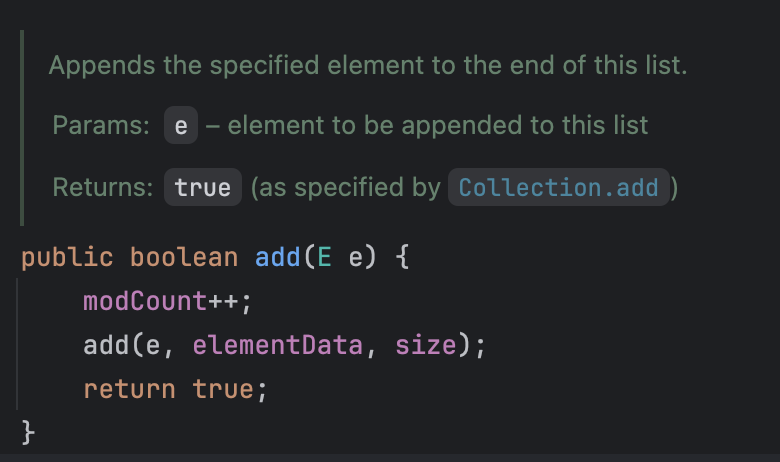
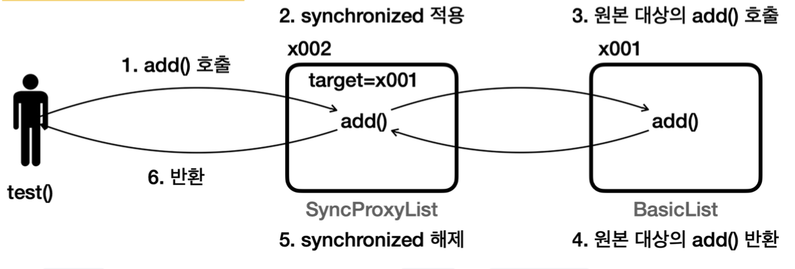
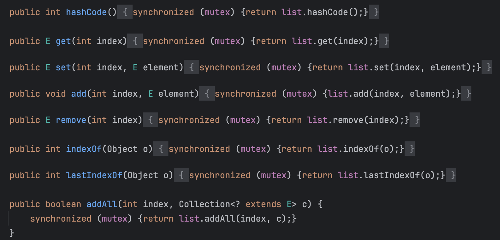

### 12장에서는 동시성 컬렉션이 왜 필요한지? 알아보고 동시성 컬렉션에 대해 학습한다

### 목차

1. [동시성 컬렉션의 필요성](#동시성-컬렉션이-왜-필요할까)
2. [프록시란?](#프록시란)
3. [동시성 컬렉션 - Synchronized](#동시성-컬렉션-synchronized)
4. [동시성 컬렉션 - Concurrent](#동시성-컬렉션---concurrent)
5. [정리](#이번-장을-진행하며-정리)

# 동시성 컬렉션이 왜 필요할까?

자바에서 기본으로 제공하는 컬렉션 프레임워크는 여러 스레드가 접근해도 괜찮을까?

여러 스레드가 접근해도 괜찮기 위해서는 원자적 연산을 제공해야 할텐데 그럴까?

ArrayList를 예시로 한번 봐보자

<p align="left">
    
</p>

list에 데이터를 추가할때 사용하는 add메서드를 보면 데이터를 넣는 작업과 list의 크기를 넣는 코드가 분리되어 있다 즉 원자적 연산이 아니라는 것이다

### 예시 코드를 통해서 확인해보자

2개의 스레드를 통해서 list에 데이터를 넣는 코드의 일부

직접 컬렉션 프레임워크를 구현해서 확인

```java
private static void test(SimpleList list) throws InterruptedException {
    log(list.getClass().getSimpleName());

    //A를 리스트에 저장하는 코드
    Runnable addA = new Runnable() {
        @Override
        public void run() {
            list.add("A");
            log("Thtread-1: list.add(A)");
        }
    };

    Runnable addB = new Runnable() {
        @Override
        public void run() {
            list.add("B");
            log("Thtread-2: list.add(B)");
        }
    };

    Thread thread1 = new Thread(addA, "Thread-1");
    Thread thread2 = new Thread(addB, "Thread-2");

    thread1.start();
    thread2.start();

    thread1.join();
    thread2.join();
    log(list);
}
```

- 데이터를 넣는 메서드 (BasicList)

```java
@Override
public void add(Object e) {
    elementData[size] = e;
    sleep(100); //멀티스레드 문제를 쉽게 확인하는 코드
    size++;
}
```

- 실행 결과

```java
22:32:07.941 [     main] BasicList
22:32:08.047 [ Thread-1] Thtread-1: list.add(A)
22:32:08.047 [ Thread-2] Thtread-2: list.add(B)
22:32:08.048 [     main] [B, null] size=2, capacity=5
```

- 결과 분석

왜 사이즈는 정상적으로 2가 되었는데 데이터 1개는 들어가지 않았을까?

- 과정
  1. list의 크기를 읽는 elementData[size]에 2개의 스레드가 동시에 도착
  2. 0번 인덱스에 Thread1 도착 후 “A”를 저장
  3. Thread2 또한 0번 인덱스에 “B”를 저장
  4. sleep()을 사용한 이유는 size++ 이 너무 빨리 호출되기에 동시성 확률을 높이기 위해 사용
  5. 여기서 2가지의 상황이 가능하다
     1. 결과 로그처럼 Thread1이 종료된 후 Thread2가 실행되어 size가 2
     2. thread1,thread2 모두 size++ 로직까지 동시 도착하여 size를 둘다 0 → 1

이렇듯 자바의 기본 컬렉션 프레임워크는 **스레드 세이프** 하지 않다

# 스레드 세이프(Thread Safe)?

여러 스레드가 동시에 접근해도 괜찮은 경우를 스레드 세이프(Thread Safe) 하다고 한다

이전 예시처럼 자바의 기본 컬렉션 프레임워크는 내부에 배열의 데이터를 추가, 데이터를 삽입, 노드를 만들어 링크에 연결 등 다양한 연산들이 이뤄지기에 원자적 연산이 아니다 그러므로 스레드 세이프 하지 않다 라고 말할 수 있다

### 그럼 멀티스레드 상황에서 컬렉션 프레임워크를 어떻게 사용해야할까?

먼저 기존의 메서드들에 synchronized 를 걸어서 해결

```java
@Override
public synchronized void add(Object e) {
    elementData[size] = e;
    sleep(100); //멀티스레드 문제를 쉽게 확인하는 코드
    size++;
}
```

결과

```java
22:48:47.488 [     main] SyncList
22:48:47.593 [ Thread-1] Thtread-1: list.add(A)
22:48:47.698 [ Thread-2] Thtread-2: list.add(B)
22:48:47.698 [     main] [A, B] size=2, capacity=5
```

정상적으로 데이터가 들어가는것을 확인

그럼 매번 컬렉션을 사용할 때 마다 동기화 메서드를 다시 구현해서 사용해야할까?

→ 이건 너무 비효율적이다

잠시 프록시를 활용한 개선하는 방식에 대해 배운다

# 프록시란?

우리말로 대리자 즉 대신 처리해주는 자라는 뜻이다

우리가 만든 컬렉션을 프록시를 활용하여 synchonized를 대신 해주게 코드를 개선해보자

우리는 인터페이스로 (SimpleList)를 통해서 size(), add(), get() 메서드를 정의하고

구현체 클래스인 BasicList 에서는 synchronized없이 메서드를 작성한다

이후 SyncProxyList 클래스에서는 똑같이 SimpleList를 구현체로 synchronized 를 대신 적용해주는 클래스이다

- 예시 코드 - main 실행문

```java
test(new SyncProxyList(new BasicList()));
//위 코드를 풀어쓰면
/**
 BasicList basicList = new BasicList();
 SyncProxyList proxyList = new SyncProxyList(basicList);
 test(proxyList);
 */
```

- 예시 코드 - SyncProxyList

```java
public class SyncProxyList implements SimpleList{

    private SimpleList target;

    public SyncProxyList(SimpleList target) {
        this.target = target;
    }

    @Override
    //1. 락 획득
    public synchronized void add(Object e) {
        //2. 원본 메서드 호출
        target.add(e);
        //3. 원본 메서드 반납
        //4. 락 반납
    }
```

- 설명

  이전에 말했듯 똑같이 SyncProxyList는 BasicList와 똑같은 SimpleList를 구현한다

  SyncProxyList 에서는 synchronized를 적용 후 BasicList의 add() 메서드를 실행시킨다

  전체 호출 과정 흐름을 보면 다음과 같다

<p align="left">
    
</p>

1. main 문의 test() 메서드는 SyncProxyList 인스턴스를 사용
2. add()를 호출하면 SyncProxyList의 add()가 synchronized가 적용되며
3. BasicList의 add()메서드가 실행된다

이런 패턴을 프록시 패턴이라고 한다

# 프록시 패턴이란?

> 프록시 패턴은 객체지향 디자인 패턴중 하나로 어떤 객체에 대한 접근을 제어하기 위해 그 객체의 대리인 또는 인터페이스 역할을 하는 객체를 제공하는 패턴이다

### 프록시 패턴의 목적

- 접근 제어 : 실제 객체에 대한 접근을 제한하거나 통제
- 성능 향상 : 실제 객체의 생성을 지연시키거나 캐싱하여 성능 최적화

실제로 프록시 패턴은 실무에서 자주 사용되는 패턴으로 스프링의 AOP 기능은 이런 프록시 패턴을 극한으로 적용한 예이다

그럼 자바에서 제공해주는 동시성 컬렉션을 이어서 살펴보자

# 동시성 컬렉션 synchronized

자바에서는 Collections에서 synchonized 동기화 메서드를 제공한다

```java
public static void main(String[] args) {
    List<String> list = Collections.synchronizedList(new ArrayList<>());
    list.add("data1");
    list.add("data2");
    list.add("data3");
    System.out.println(list.getClass());
    System.out.println("list = " + list);
}
```

사용 방법은 `Collections.synchronizedList(new ArrayList<>());` 를 통해서 list를 생성하면 된다

SynchronizedList는 synchronized를 추가하는 프록시 역할을 한다

Collections의 synchonized 메서드를 사용하면 List, Collection, Map, Set등 동기화 프록시를 만들어 낼 수 있다

- synchonizedList()
- synchronizedCollection()
- synchronizedMap()
- synchronizedSet()

SynchonziedList의 코드를 확인해보면

<p align="left">
    
</p>

synchronized를 대신 걸어주는 프록시 역할을 한다는 점을 볼 수 있다

### synchronizedList의 단점

- synchronized를 통해 컬렉션 전체에 대한 동기화가 이루어지지만 특정 부분이나 메서드에 대해서 선택적으로 동기화를 적용하는 것이 어렵다는 점이다 즉 동기화 오버헤드가 발생한다
- 예를 들어 읽기가 많은 상황에서 read 메서드에도 락이 걸려있어 성능이 저하가 되는 경우가 있을 것이다

### 따라서 미리 말하지만 이 방식은 이제는 많이 사용되지 않는다고 한다

# 동시성 컬렉션 - Concurrent

자바 1.5부터 동시성을 위한 컬렉션이 추가되었다

java.util.concurrent 패키지에서 제공을 하며 고성능 멀티스레드 환경을 지원하는 다양한 동시성 컬렉션 클래스들을 제공한다

### 종류

- List
  - CopyOnWriteArrayList → ArrayList 대안
- Set
  - CopyOnWriteArraySet → HashSet 대안
  - ConcurrentSkipListSet → TreeSet의 대안 (정렬된 순서, Comparator 사용가능)
- Map
  - ConcurrentHashMap → HashMap의 대안 (가장 많이 사용한다)
  - ConcurrentSkipListMap → TreeMap의 대안(정렬된 순서, Comparator 사용 가능)
- Queue
  - ConcurrentLinkedQueue → 동시성 큐, 비 차단(non-blocking) 큐이다
- Deque
  - ConcurrentLinkedDeque → 동시성 디큐

### 비 차단(non-blocking)

- 락을 대기하지 않는 구조, 즉 다른 스레드가 작업중이어도 기다리지 않고 실행
- 동시성이 가능한 이유 : CAS(Compare And Swap)
  - 예시로
    1. head → Thread1 → tail (tail이라는 값을 추가)
    2. head → Thread2 → newTail 이라면
    3. Thread1이 먼저 작업 성공 가정
    4. Thread2는 tail에서 값이 바뀐것을 확인 후 재시도 로직이 실행
    5. head → tail → newTail 모두 순차적으로 실행

### 동시성 컬렉션 적용 예시 코드

```java
public static void main(String[] args) {
    Map<Integer, String> map1 = new ConcurrentHashMap<>();
    map1.put(3, "data3");
    map1.put(1, "data1");
    map1.put(2, "data2");
    //순서 보장 x
    System.out.println("map1 = " + map1);

    Map<Integer, String> map2 = new ConcurrentSkipListMap<>();
    map2.put(3, "data3");
    map2.put(1, "data1");
    map2.put(2, "data2");
    //정렬하여 순서 보장
    System.out.println("map2 = " + map2);
}
```

결과

```java
map1 = {1=data1, 2=data2, 3=data3}
map2 = {1=data1, 2=data2, 3=data3}
```

# 이번 장을 진행하며 정리

- 동시성 컬렉션이 왜 필요한가? -> 자바의 기본 컬렉션은 동시성문제를 해결할 수 없다(즉, 내부의 로직이 원자적 연산이 아니다!)

- 프록시 - 대리인의 역할
- 프록시 패턴 : 객체지향 디자인 패턴중 하나, 인터페이스 역할을 하는 객체를 제공하는 패턴
- synchronized 방식 : 모든 메서드에 synchronized가 사용되어 불필요한 상황, 부분 적용 안된다, 요즘엔 보통 잘 안쓰인다.
- cocurrent 방식 : 특히 `ConcurrentHashMap` 이 가장 많이 사용되며 내부에 Synchronized, ReentrantLock등 다양한 로직을 통해 최적화 되어있다. 보통 요즘은 이걸 사용한다
