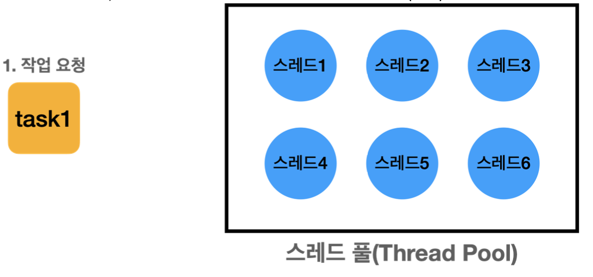
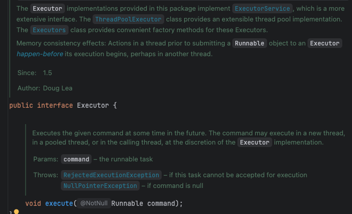
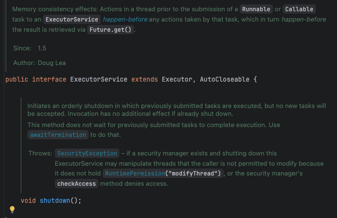
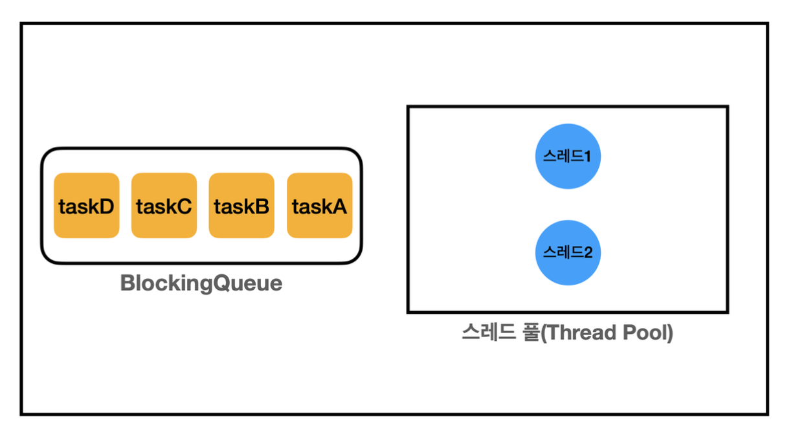
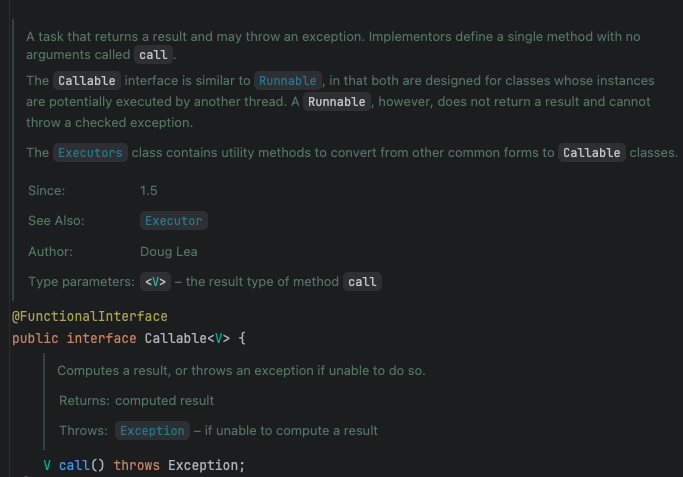
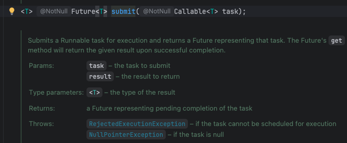
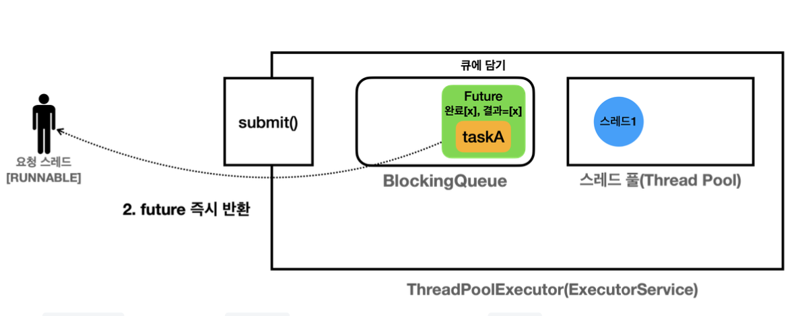

# 13장 - 스레드 풀

### 13장에서는 Executor, Callable, Future에 대해 학습한다

### 목차

1. [스레드 직접 생성의 문제점](#스레드를-직접-생성할-경우-문제점)
2. [Executor](#executor-인터페이스)
3. [Callable & Future](#callable--future)
4. [정리](#이번-장을-진행하며-정리)

# 스레드를 직접 생성할 경우 문제점

1. 스레드 생성 시간으로 인한 성능 저하
   1. 스레드 생성은 운영체제 커널 수준에서 이루어지며 이때 시스템 콜을 통해 처리 된다 (이때 CPU와 메모리 리소스 사용)
   2. 생성된 스레드는 운영체제의 스케줄러가 스레드를 관리하고 실행순서를 조정 (이때 스케줄링 알고리즘에 따라 추가적인 오버헤드 발생)
   3. 스레드가 실행되는 동안 호출 스택이라는 메모리의 공간을 사용해야한다
   - 정리하면 스레드를 생성하는 작업은 상대적으로 무겁고 간단한 작업을 위한 스레드 생성이라면 작업시간 보다 스레드 생성 시간이 더 걸릴 수도 있다
2. 스레드 관리 문제
   1. 안전한 종료를 위해 남은 작업 후 종료 혹은 급하게 종료해야해서 인터럽트를 사용한다고 할때 이런 스레드를 관리하는 리소스가 있어야 한다
3. Runnable 인터페이스의 불편함
   1. 반환값이 없다 : 멤버변수에 값을 보관 후 값을 받아야 하며 join() 등을 사용해서 스레드가 종료되길 기다려야 한다
   2. 예외 처리 : 반드시 체크 예외를 메서드 내부에서 처리해야한다

### 스레드 풀?

<p align="left">
    
</p>

> 스레드를 관리하는 스레드 풀(스레드가 모인 수영장 풀 같은 개념)에 스레드를 미리 필요한 만큼 미리 만들어둔다

- 작업 요청이 올경우
  1. 풀에서 스레드를 조회(`WAITING`)
  2. 작업을 처리(`RUNNABLE`)
  3. 스레드를 다시 스레드 풀에 반납(`WAITING`)

Okay 그럼 스레드 풀을 사용해서 기존의 스레드 생성 시간 문제를 해결했다 그럼 우리가 직접 스레드 풀을 구현하냐?

→ 자바가 제공하는 **Executor 프레임워크**가 있다

# Executor 인터페이스

<p align="left">
    
</p>

`Executor`는 인터페이스로 기본적으로 `execute` 실행 메서드 하나를 가지고 있다

`Executor` 프레임워크는 멀티스레딩 및 병렬 처리를 쉽게 사용할 수 있도록 돕는 기능의 모음이다

이를 통해 개발자가 직접 스레드를 관리하는 복잡함을 줄여준다

<p align="left">
    
</p>

주로 사용하는건 기능이 추가된 `Executor`를 확장한 `ExecutorService`이다

대표 구현체로는 `ThreadPoolExecutor`가 존재한다

### ThreadPoolExecutor 구조

<p align="left">
    
</p>

스레드 풀 : 스레드를 보관하고 관리한다

블록킹 큐 : 작업을 보관한다

스레드 풀을 생성하는 코드

```java
ExecutorService es =
new ThreadPoolExecutor(
2, //corePoolSize
2, //maximumpoolSize
0, //keepAliveTime
TimeUnit.MILLISECONDS, //keepAliveTime 단위
new LinkedBlockingQueue<>()); //작업 큐
```

스레드 풀 생성자의 매개변수

- `corePoolSize` - 항상 유지되는 기본 스레드 수
- `maximumPoolSize` - 최대 몇 개까지 스레드를 늘릴 수 있는지 설정
- `keepAliveTime` - 스레드가 어느 기간 동안 놀면 종료시킬지 결정
- `BlokingQueue` - 작업 대기 큐

편의 코드

```java
ExecutorService es = ExecutorService.newFixedThreadPool(2);
```

참고 - 왜 작업 대기 큐를 일반 큐가 아닌 블록킹 큐를 사용할까?

> 스레드 풀의 스레드가 Queue에서 작업을 가져갈 때 작업이 없으면 대기(블록킹) 해야하기 때문에 반드시 블록킹 큐를 사용 해야한다

Okay이제 스레드를 직접 생성할때 2가지 (스레드 생성 시간 비용, 스레드 관리) 문제에 대한 해답을 얻었다 그럼 마지막 Runnable 을 사용할때 반환값이 없어서 멤버변수에 담아서 해결과 체크예외 문제는 어떤 방식일까?

# Callable & Future

자바에서는 스레드의 결과값을 return을 통해 반환할 수 있게 `Future`와 `Callable` 라는 인터페이스를 도입하여 해결했다

먼저 `Callable` 인터페이스 부터 봐보자

### Callable

<p align="left">
    
</p>

`callable`은 `Runnable`의 결과 반환을 못하는 문제를 V(제네릭 타입)을 통해서 해결을 해준다

`call()` 메서드는 `Runnable`의 `run()`메서드와 같이 스레드가 할 작업을 정의하는 메서드이다

`run()` 메서드의 정의 작업을 실행하기 위해서는 `submit()` 메서드를 활용한다

또한 `throws Exception` 에서 볼 수 있듯이 체크 예외를 던지는게 가능하다

이를 통해 필요하다면 `future.get()`에서 처리하는 것이 가능해진다

<p align="left">
    
</p>

`submit()`를 통해 `Callable`의 작업을 전달할 수 있다

반환 타입이 `Future`라는 인터페이스인 것을 확인할 수 있다

### Future

Future는 비동기 작업(`Callable`)의 결과를 나중에 받을 수 있도록 해주는 객체다

주요 메서드

    future.get() : 작업이 끝날 때까지 기다림(blocking)

    future.isDone() : 작업이 끝났는지 boolean타입으로 반환

    future.cancel(true/false) : 아직 완료되지 않은 작업을 취소

        true : Future를 취소 상태로 변경, 실행중이라면 인터럽트를 통해서 중단

        false : Future를 취소 상태로 변경, 실행중이라면 끝까지

    future.invokeAll() : 모든 Callable 작업을 제출하고 모든 작업 종료까지 기다린다

    future.invokeAny() : 하나라도 작업이 완료되면 결과를 반환하고 나머지 작업은 취소

### 그럼 왜 Future를 Callable과 같이 사용할까?

예시 코드를 보자

```java
//작업 요청
ExecutorService es = Executors.newFixedThreadPool(3);
Future<Boolean> inventoryFuture = es.submit(inventoryWork);
Future<Boolean> shippingFuture = es.submit(shippingWork);
Future<Boolean> accountingFuture = es.submit(accountingWork);

//결과값을 대기
Boolean inventoryResult = inventoryFuture.get();
Boolean shippingResult = shippingFuture.get();
Boolean accountingResult = accountingFuture.get();
```

코드 설명

- `inventoryWork, shippingWork, accountingWork`는 Callable을 구현한 클래스이다(작업)
- `es.submit()`을 통해서 스레드풀을 통해서 작업을 실행한다, 이때 중요한 점은 이걸 실행하는 main스레드는 값 반환을 Future를 통해서 받고 기다리지 않고 비동기로 시행한다는 점이다
- `inventoryFuture.get()`을 했을때 2가지 상황이 있다
  - 작업 스레드의 작업이 끝났다면 바로 반환이 되고
  - 작업이 남아있다면 기다렸다가 값을 받는다

<p align="left">
    
</p>

- 스레드 풀에서 실행된 비동기 작업의 결과(값, 예외, 상태)를 안전하게 제어하고 받아오기 위한 표준이기 때문
- Runnable의 join은 결과 전달, 예외 전달, 취소 등 비동기 제어가 불가능하기 때문에 Future를 사용한다

위의 코드를 invokeAll()을 적용하면 다음과 같다

```java
InventoryWork inventoryWork = new InventoryWork(orderNo);
ShippingWork shippingWork = new ShippingWork(orderNo);
AccountingWork accountingWork = new AccountingWork(orderNo);

List<Callable<Boolean>> tasks = List.of(inventoryWork, shippingWork, accountingWork);
List<Future<Boolean>> futures = es.invokeAll(tasks);
```

예시 코드에서는 List를 활용하여 작업에 대한 결과를 담았다

invokeAll()에는 매개변수로 callable의 작업을 같이 전달해주면 된다

# 이번 장을 진행하며 정리

- 스레드를 직접 사용할떄의 문제점
  - 스레드 생성시간 비용 크다
  - 스레드 관리하는 부담
  - `Runnable`은 체크 예외 처리, 반환값이 없어 멤버변수로 전달할떄의 위험성
- ExecutorService
  - `Executor`의 확장한 인터페이스
  - 대표 구현체로는 `ThreadPoolExecutor`
    - `ThreadPoolExecutor` 내부 구조에는 블록킹 큐(작업), 스레드 풀(스레드 대기)
- Callable
  - `Runnable`의 반환값 없음을 해결
  - `call()`메서드에 스레드 작업을 정의
  - 체크 예외를 상위로 던지는게 가능하다
- Future
  - 미래의 결과를 미리 받는 객체
  - `future.get()` 전까지 `main`스레드는 대기할 필요 없다 (비동기)
  - `future`에는 `callable` 작업의 완료 여부, 결과 값, 예외 등을 저장한다
