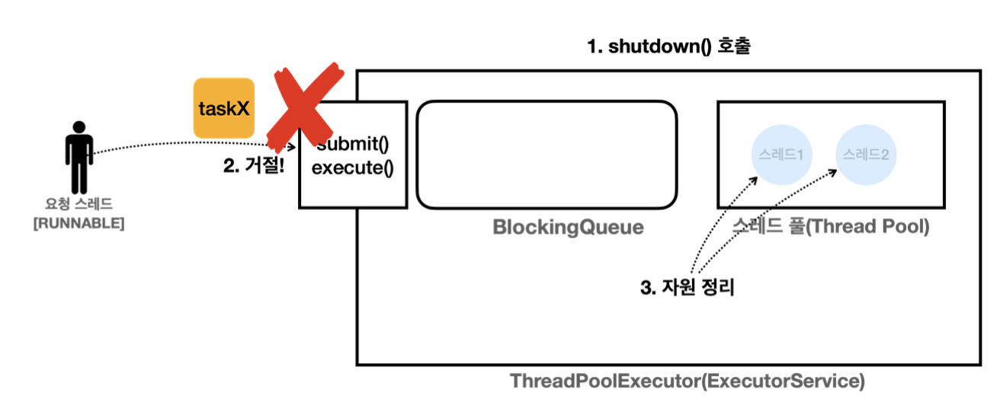
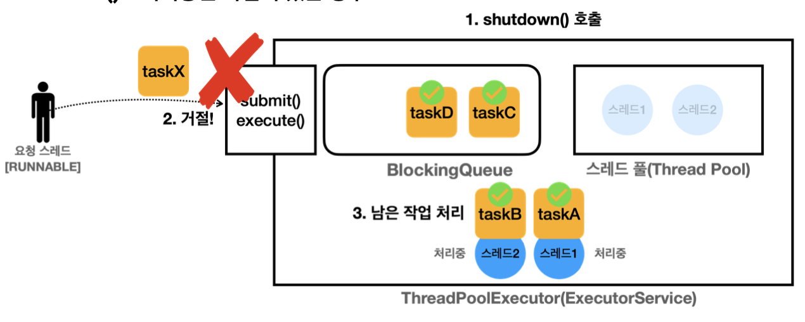
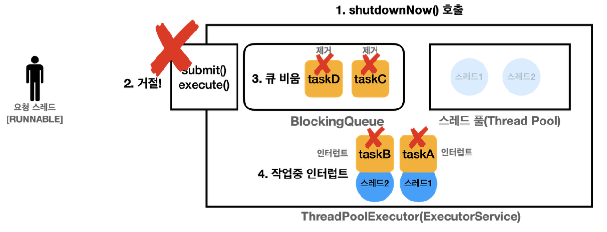
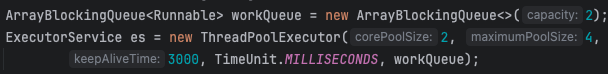
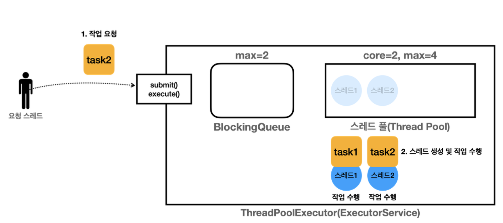
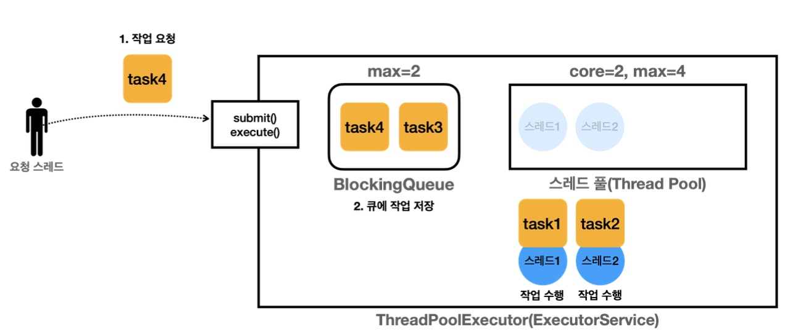
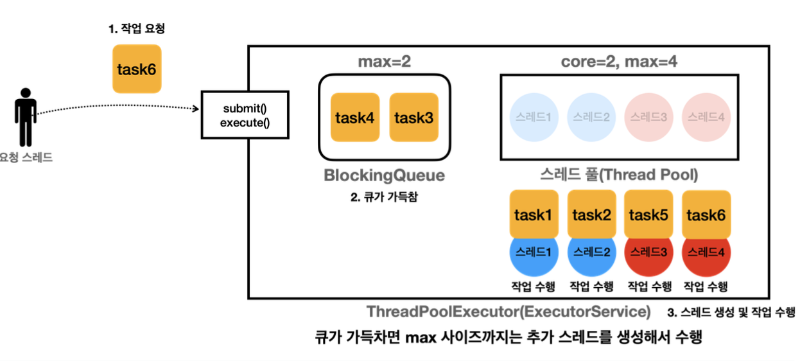
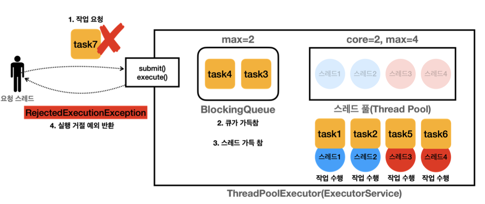
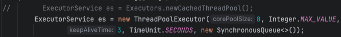

# 14장 - 스레드 풀

### 14장에서는 ExecutorService 활용과 우아한 종료를 위한 Executor 전략에 대해 학습한다

### 목차

1. [우아한 종료?](#우아한-종료graceful-shutdown-란)
2. [Executor의 스레드 관리](#executor-스레드-풀-관리)
3. [Executor 전략](#스레드-풀-관리-전략)
4. [정리](#이번-장을-진행하며-정리)

# 우아한 종료(graceful shutdown) 란?

서비스가 문제 없이 종료되는 것을 말하는데

> 만약 서버 기능을 업데이트를 위하여 서버를 재시작 해야한다 가정할때 이때 사용자의 요청을 처리중 갑자기 재시작된다면? 어떻게 해야할까?

가장 이상적인 방법은 새로운 주문은 막고 이미 진행중인 주문을 완료 후 서버를 재시작 하는 것이 가장 좋을 것이다 이처럼 안정적으로 서비스를 종료하는 것을 말한다

>

### ExecutorService의 종료 메서드

- `shutdown()`
  - 새로운 작업을 받지 않고 이미 처리중인 작업을 완료후 종료한다
  - 논 블로킹 메서드
- `shutdownNow()`

  - 강제 종료를 하며 작업중인 스레드에 인터럽트가 발생한다
  - 논 블로킹 메서드

- `boolean isShutdown()`
  - 서비스가 종료되었는지 확인
- `boolean isTerminated()`
  - shutdown(), shutdownNow() 호출 후 모든 작업이 완료되었는지 확인

### shutdownNow()를 호출시 주의점

> shutdownNow()를 통해 작업중인 스레드에 인터럽트를 걸지만 인터럽트를 호출하더라도 여러가지 이유로 작업에 시간이 걸릴 수 있다
>
> - 예를 들어 스레드가 while(true) {…} 과 같이 인터럽트를 받을 수 없는 코드
> - 이럴 경우에는 자바를 강제 종료해야 제거할 수 있다

### 작업이 없는 경우 shutdown() 호출

<p align="left">
    
</p>

1. `shutdown()` 호출시 추가적인 작업은 받지 않으며, 현재 작업이 남아 있는지 확인
2. 추가 요청 작업의 경우 `RejectedExecutionException` 예외가 터지며 거절한다
3. 남아 있는 작업이 없으므로 스레드 풀의 자원을 정리하고
4. 종료된다

### 작업이 있는 경우 shutdown() 호출

<p align="left">
    
</p>

1. `shutdown()` 호출시 추가적인 작업은 받지 않으며, 기존의 남아 있는 작업(BlockingQueue)에 남은 작업을 처리한다
2. 추가 요청시 똑같이 `RejectedExecutionException` 예외가 터지며 거절
3. 남은 작업을 모두 처리 후에는 스레드 풀 자원을 정리한다

### 작업이 있는 경우 shutdownNow() 호출

<p align="left">
    
</p>

1. shutdownNow() 호출시 작업은 받지 않으며, 기존의 남아 있는 작업에는 인터럽트가 걸리고 작업 대기 큐(블로킹 큐)에는 작업이 제거 된다
2. 이후 스레드 풀의 자원을 정리하고 종료된다

# Executor 스레드 풀 관리

Executor 프레임워크가 어떤 식으로 스레드를 관리하는지 깊이 알아본다

<p align="left">
    
</p>

ExecutorService의 기본 구현체 ThreadPoolExecutor의 생성자는 다음 속성을 사용한다

- `corePoolSize` : 스레드 풀에서 관리되는 기본 스레드 수
- `maximumPoolSize` : 스레드 풀에서 관리되는 최대 스레드 수
- `keepAliveTime`, `TimeUnit unit` : 초과 스레드가 생존할 수 있는 대기 시간, 생존시간동안 처리할 작업이 없다면 스레드는 제거된다
- `BlockingQueue` : 작업을 보관할 블로킹 큐

### 참고 (다시한번 왜 블로킹 큐를 사용해 작업을 저장하는지

> 일반 큐의 경우 작업의 존재 여부 확인을 위해 while(true)로 무한 반복을 통해 확인을 한다던가 필요. 하지만 블로킹 큐의 경우 작업이 없으면 자동 대기(Block)을 통해 CPU 자원을 절약할 수 있다

### 그럼이제 예시 코드를 통해서 ThreadPoolExecutor의 스레드 관리 과정을 보자

예시 코드

```java
public static void main(String[] args) {
    ArrayBlockingQueue<Runnable> workQueue = new ArrayBlockingQueue<>(2);
    ExecutorService es = new ThreadPoolExecutor(2, 4,
            3000, TimeUnit.MILLISECONDS, workQueue);
    printState(es);

    es.execute(new RunnableTask("task1"));
    printState(es, "task1");

    es.execute(new RunnableTask("task2"));
    printState(es, "task2");

    //3번째 작업때도 왜 maximumThread값이 4인데 왜 안될까?
    es.execute(new RunnableTask("task3"));
    printState(es, "task3");

    es.execute(new RunnableTask("task4"));
    printState(es, "task4");

    es.execute(new RunnableTask("task5"));
    printState(es, "task5");

    es.execute(new RunnableTask("task6"));
    printState(es, "task6");

    try {

        es.execute(new RunnableTask("task7"));
        printState(es, "task7");
    } catch (RejectedExecutionException e) {
        log(" task7 실행 거절 예외 발생: " + e);
    }

    sleep(3000);
    log("== 작업 수행 완료");
    printState(es);
    sleep(3000);
    log("== maximumPoolSize 대기 시간 초과 == ");
    printState(es);
    es.close();
    log("== shutdown 완료 == ");
    printState(es);
}
```

코드 결과

```java
23:00:27.129 [     main] [pool=0, active=0, queuedTasks=0, completedTask=0]
23:00:27.130 [pool-1-thread-1] task1 시작
23:00:27.134 [     main] task1 -> [pool=1, active=1, queuedTasks=0, completedTask=0]
23:00:27.134 [     main] task2 -> [pool=2, active=2, queuedTasks=0, completedTask=0]
23:00:27.134 [pool-1-thread-2] task2 시작
23:00:27.134 [     main] task3 -> [pool=2, active=2, queuedTasks=1, completedTask=0]
23:00:27.134 [     main] task4 -> [pool=2, active=2, queuedTasks=2, completedTask=0]
23:00:27.134 [     main] task5 -> [pool=3, active=3, queuedTasks=2, completedTask=0]
23:00:27.135 [pool-1-thread-3] task5 시작
23:00:27.135 [pool-1-thread-4] task6 시작
23:00:27.135 [     main] task6 -> [pool=4, active=4, queuedTasks=2, completedTask=0]
23:00:27.135 [     main]  task7 실행 거절 예외 발생: java.util.concurrent.RejectedExecutionException: Task thread.executor.RunnableTask@277050dc rejected from java.util.concurrent.ThreadPoolExecutor@2f4d3709[Running, pool size = 4, active threads = 4, queued tasks = 2, completed tasks = 0]
23:00:28.134 [pool-1-thread-1] task1 완료
23:00:28.135 [pool-1-thread-1] task3 시작
23:00:28.138 [pool-1-thread-4] task6 완료
23:00:28.138 [pool-1-thread-3] task5 완료
23:00:28.138 [pool-1-thread-2] task2 완료
23:00:28.139 [pool-1-thread-4] task4 시작
23:00:29.140 [pool-1-thread-1] task3 완료
23:00:29.141 [pool-1-thread-4] task4 완료
23:00:30.139 [     main] == 작업 수행 완료
23:00:30.140 [     main] [pool=4, active=0, queuedTasks=0, completedTask=6]
23:00:33.144 [     main] == maximumPoolSize 대기 시간 초과 ==
23:00:33.145 [     main] [pool=2, active=0, queuedTasks=0, completedTask=6]
23:00:34.151 [     main] == shutdown 완료 ==
```

### 과정 설명 - 여기서 관점 포인트는 언제 최대 스레드를 사용할까?

printState(es) : ThreadPool 의 상태를 로그로 기록

1. task1, task2를 작업 요청시 `coreThread`수를 넘지 않으므로 작업 요청시 스레드를 생성하여 작업 수행

<p align="left">
    
</p>

1. task3, task4를 수행시 추가 스레드가 생성될까? → 아니다. `Executor`는 `ThreadPool`의 `core`스레드 수를 체크(이미 2개 존재)확인 후 `BlockingQueue`를 확인하여 작업보관 수 2개를 넘는지 확인한다 → 이후 2개의 작업은 작업 대기 블로킹 큐에 보관이 된다.

<p align="left">
    
</p>

```java
23:00:27.134 [     main] task3 -> [pool=2, active=2, queuedTasks=1, completedTask=0]
23:00:27.134 [     main] task4 -> [pool=2, active=2, queuedTasks=2, completedTask=0]
```

1. task5,task6 요청이 오면 똑같이 core스레드 수와 작업대기 큐를 확인 → 이미 core스레드 수 만큼 동작하며 작업대기 큐도 가득찼기 때문에 이때 maximumPoolSize 까지 스레드 수를 늘려 작업을 바로 처리한다

<p align="left">
    
</p>

```java
23:00:27.135 [pool-1-thread-3] task5 시작
23:00:27.135 [pool-1-thread-4] task6 시작
```

따라서 task3,4 보다 task5,6이 먼저 추가 스레드를 통해서 먼저 작업이 실행되는 것을 볼 수 있다

1. 이때 최대로 동작 상황에서 task7의 요청이 오면? → 작업 대키 큐 가득참, max스레드 사이즈 만큼 스레드 풀 사용중 → `RejectedExecutionException` 발생한다

<p align="left">
    
</p>

```java
23:00:27.135 [     main]  task7 실행 거절 예외 발생: java.util.concurrent.RejectedExecutionException: Task thread.executor.RunnableTask@277050dc rejected from java.util.concurrent.ThreadPoolExecutor@2f4d3709[Running, pool size = 4, active threads = 4, queued tasks = 2, completed tasks = 0]
```

1. 이후 작업이 끝날때까지 sleep(3000)을 통해 기다린 뒤 스레드 풀의 상태를 보면

```java
23:00:30.139 [     main] == 작업 수행 완료
23:00:30.140 [     main] [pool=4, active=0, queuedTasks=0, completedTask=6]
23:00:33.144 [     main] == maximumPoolSize 대기 시간 초과 ==
23:00:33.145 [     main] [pool=2, active=0, queuedTasks=0, completedTask=6]
```

작업이 끝난 직후에는 4개의 스레드가 ThreadPool에서 대기하며

여기서 추가로 sleep(3000)을 통해 기다린뒤 다시 확인하면 원래 core스레드 수인 2개의 스레드로 돌아온 것을 확인할 수 있다

# 스레드 풀 관리 전략

지금까지 언제 max 스레드를 생성하는지 전체 흐름을 살펴보았다면 이를 관리하는 여러 전략들에 대해서 살펴보자

1. 단일 고정 풀 전략
2. 고정 스레드 풀 전략
3. 캐시 스레드 풀 전략

### 고정 풀 전략 - newFixedThreadPool(nThreads)

- 스레드 풀에 nThreads 만큼 core스레드를 생성 (단일 스레드 풀 전략은 core스레드 1개)
- 초과 스레드는 생성하지 않는다.
- 작업을 대기하는 블로킹 큐에는 사이즈의 제한이 없다 (`LinkedBlockingQueue`)
- 스레드 수가 고정되어 CPU, 메모리 리소스가 예측이 가능한 안정적인 방식

```java
ExecutorService es = Executors.newFixedThreadPool(2);
/*ExecutorService es = new ThreadPoolExecutor(2, nThreads,
      0L, TimeUnit.MILLISECONDS, new LinkedBlockingQueue<Runnable>());
*/
```

`Executors.newFixedThreadPool(nThreads)`를 통해 생성하며 풀어쓰면 주석과 같다

`LinkedBlockingQueue`를 통해 core스레드 이상의 작업이 요청되면 그냥 작업 대기 큐에서 무한정 대기한다

### 단일 고정 풀 전략 - 특징

- 스레드 수 고정을 통해 CPU,메모리 리소스가 어느정도 예측 가능 → 안정적 운영
- 큐 사이즈 제한도 없기에 작업을 많이 담아도 문제가 없다

### 단일 고정 풀 전략 - 문제점

- 사용자가 많아지면 서비스 응답이 느려지는 문제 발생

### 캐시 풀 전략 - newCachedThreadPool()

<p align="left">
    
</p>

- 기본(`core`) 스레드는 사용하지 않고 60초 생존 주기를 가진 초과 스레드만 사용
  - 예제에서는 확인을 위해 생존 주기를 3초로 짧게 설정하여 확인
- 초과 스레드의 수는 제한이 없다
- 큐에 저장하지 않는다 (`SynchronousQueue`) 사용
  - 이 큐는 내부에 저장 공간이 없다. 따라서 생산자의 작업을 소비자 스레드에게 직접 전달한다

```java
//        ExecutorService es = Executors.newCachedThreadPool();
ExecutorService es = new ThreadPoolExecutor(0, Integer.MAX_VALUE,
        3, TimeUnit.SECONDS, new SynchronousQueue<>());
```

### 캐시 풀 전략 - 특징

- 기본 스레드가 없으며, 대기 큐에도 작업이 쌓이지 않는다
  - 작업 요청이 오면 초과 스레드를 활용하여 바로 바로 처리한다
  - 추가 스레드 작업이 끝나면 기본값(60초) 동안 생존하며 작업 수에 맞추어 적절한 수의 스레드가 재사용된다
- 동작 흐름 정리
  1. 작업 요청 → synchoronousQueue는 저장 공간 X → 바로 추가 스레드를 생성하여 작업
  2. 작업 후 ThreadPool에서 생존 주기 만큼 대기
  3. 추가 요청이 오면 ThreadPool을 확인하여 스레드 확인후 있으면 재사용, 없으면 생성하여 작업
  4. 작업 후 스레드는 다시 60초 만큼 대기 하며 작업요청이 없으면 스레드 종료

### 캐시 풀 전략 - 문제점

- 작업 요청량이 늘어날 경우 CPU 메모리의 사용량도 자연스럽게 증가한다
  → CPU 메모리 자원은 한계가 있기 때문에 적절한 시점에 시스템을 증설해야 한다 그렇지 않으면 서버가 다운될 수 있다
- 너무 많은 스레드가 작업을 처리하면서 시스템 전체가 느려지는 문제가 발생

### 2개의 전략 정리

- 고정 스레드 풀 전략은 서버 자원은 여유가 있지만 사용자가 느려지는 문제가 있으며
- 캐시 스레드 전략은 서버의 자원을 최대한 사용하지만 서버의 감당 영역을 넘으면 서버가 다운될 수 있는 심각한 문제가 있다

### 실무에서 자주 하는 실수

```java
new ThreadPoolExecutor(100, 200, 60, TimeUnit.SECONDS, new
LinkedBlockingQueue());
```

이 코드의 문제점은 무엇일까?

100개의 요청을 처리하는 core스레드가 동작중이고 추가로 101번째 요청이 온다면 어떻게 될까? max스레드 수가 200이니까 101번째 스레드가 생성되어 작업을 할까?

## 아니다!!!!!!!!!

**최대 스레드가 생성되는 경우는 작업 큐가 가득 차있고 ThreadPool에 대기중인 스레드가 없을 때 라고 했었다**

> 코드를 보면 LinkedBlockingQueue를 작업 대기 공간으로 사용중이다LinkedBlockingQueue는 작업이 꽉찰일이 없다! 계속해서 작업을 저장할 수 있기 때문에 해당코드는 100개의 스레드만 계속 활용하는 문제가 있는 코드이다

### 그럼 어떤 전략을 사용해야 할까?

> 실무에서는 해당 기능이 사용자가 얼마나 많을지 예측이 되지 않는데 과도한 최적화는 지양한다 또한 서버의 리소스는 모니터링을 통해서 현재 스레드 상태와 CPU 상태를 보기때문에 어느정도 에측이 가능하다

→ 따라서 일반적인 상황이라면 고정 스레드 풀 전략이나, 캐시 스레드 풀 전략을 사용하면 충분하다

# 이번 장을 진행하며 정리

- 우아한 종료 : 서버 업데이트와 같이 종료 서버를 종료시켜야 할때 진행중인 작업을 안정적으로 마치고 서버를 종료
  - shutdown() : 작업 추가요청 X, 진행중인 작업 마무리 후 종료
  - shutdownNow() : 진행중인 작업에 인터럽트를 통해 작업 중지 및 종료
- ExecutorService의 스레드 관리
  - core, max, aliveTime, Queue 설정을 통해 사용
- 언제 추가 스레드 생성?
  - ThreadPool에서 대기중 스레드 없고 && Queue 가득참
  - 추가 스레드 생성을 위해서는 SynchronousQueue를 사용하면 안된다
- 스레드 전략
  - 고정 풀 스레드
    - LinkedBlockingQueue를 통해 작업을 크기 상관없이 보관
    - 안정적인 리소스로 운영
    - 서비스 응답이 느려질 수 있다
  - 캐시 풀 스레드
    - core스레드가 아닌 추가 스레드를 통해서만 작업
    - SynchronousQueue를 활용하여 작업을 바로 바로 처리
    - 요청이 매우 많으면 CPU, 메모리 과부하로 서버 다운 위험
