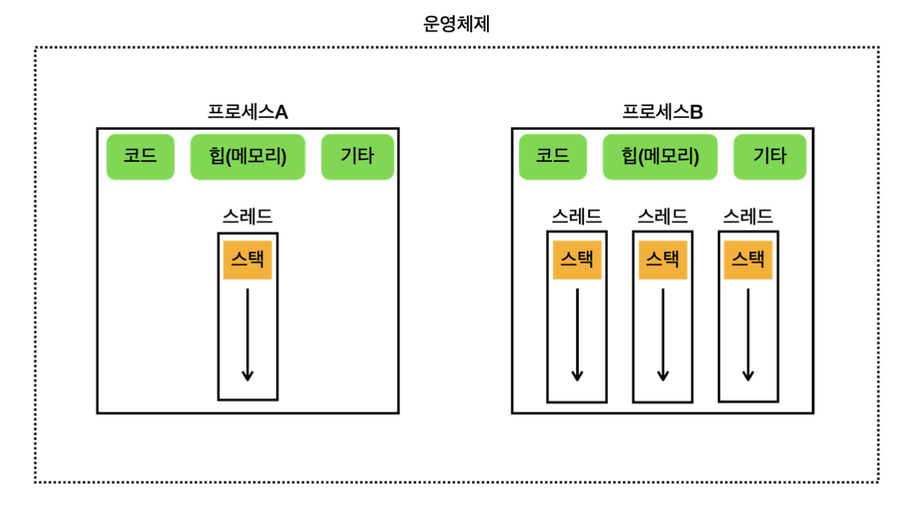
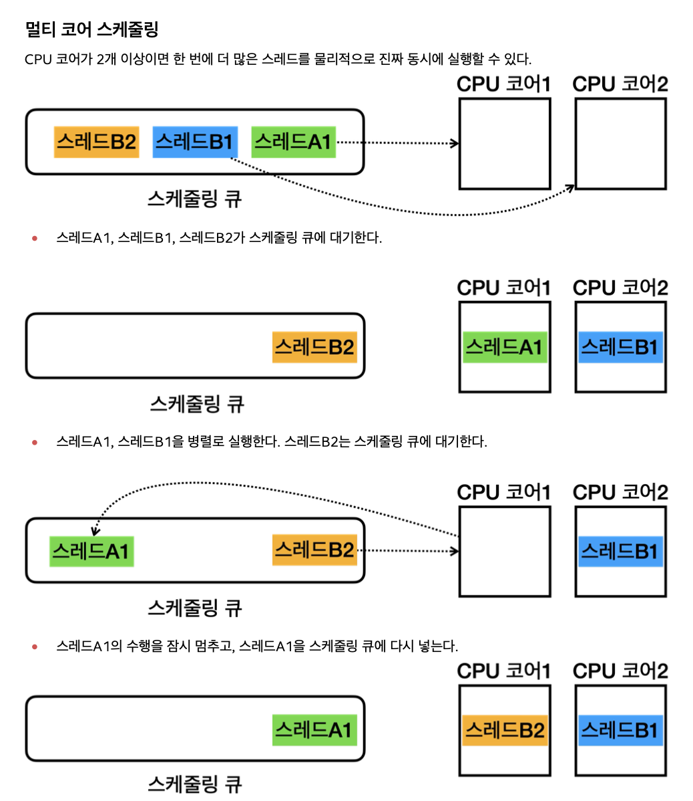

# 2장 - CS

### 2장에서는 프로세스와 스레드의 관계에 대해 정리한다

### 멀티 태스킹?

- 하나의 컴퓨터에서 스케쥴링을 통해 동시에 여러 작업을 수행하는 능력
- 단일 CPU(단일 CPU 코어)가 여러 작업을 동시에 수행하는 것처럼 보이게 하는 것을 의미

  스케쥴링 : 운영체제가 스케쥴링을 통해서 CPU를 최대한 사용하면서 작업이 골고루 수행될 수 있게 최적화하는것

### 멀티 프로세싱?

- 컴퓨터 시스템에서 둘 이상의 프로세서(CPU 코어)를 사용하여 여러 작업을 동시에 처리하는 기술을 의미
- 여러 CPU(여러 CPU 코어)를 사용하여 동시에 여러 작업을 수행하는 것을 의미

### 멀티 태스킹 vs 멀티 프로세싱

- 멀티 프로세싱은 하드웨어 관점이고 멀티 태스킹은 운영체제 소프트웨어의 관점이다

---

### 프로세스와 스레드

    

### 프로세스

- 프로그램은 실제 실행하기 전까지는 단순한 파일이다
- 프로그램을 실행하면 프로세스가 만들어지고 프로그램이 실행된다
- 이렇게 운영체제 안에서 실행중인 프로그램을 프로세스라 한다
- 이때 각각의 프로세스는 서로 격리되어 관리되기 때문에, 하나의 프로세스가 충돌해도 다른 프로세스에는 영향이 없다

### 스레드

- 프로세스는 하나 이상의 스레드를 반드시 포함한다
- 한 프로세스 내에서 여러 스레드가 존재할 수 있으며, 이들은 프로세스가 제공하는 동일한 메모리 공간을 공유한다

### 프로세스와 스레드의 관계

- 정리를 해보자면 프로그램이 실행중인 상태를 프로세스라고 하며, 이때 프로세스 안에 있는 코드가 한 줄씩 실행되는데 이때 스레드가 사용

### 스케쥴링 큐

    

- 이전에 말했듯 CPU에 어떤 프로그램이 얼마만큼 실행될지를 운영체제가 결정하는데 이것을 스케쥴링이라 하며, 이때 운영체제는 스케쥴링 큐를 가지고 각각의 스레드를 큐에서 대기한 후 실행하는 방식으로 프로세스가 실행된다

### 컨텍스트 스위칭

- CPU가 여러 스레드나 프로세스를 번갈아 실행할 때, 이전에 하던 작업의 상태(어디까지 했는지 등)를 저장하고 다음에 할 작업의 상태를 불러오는 과정
- 이 과정에서 시간이라는 비용이 크게 발생한다

### 그렇다면 컨텍스트 스위칭이 발생하지 않게 하려면?

- 이상적으로는 CPU 코어 수 + 1개 정도로 스레드를 맞추면 특정 스레드가 잠시 대기할 때 남은 스레드를 활용가능하다고 한다

### 그러면 무조건 코어수 + 1 개의 스레드로 설정하면 되냐?

- 실무의 웹 애플리케이션 서버 관점에서는 틀리다
- 각 스레드가 하는 작업은 크게 2가지로 **CPU바운드 작업**과 **I/O바운드 작업**으로 나눌수 있는데, 웹 애플리케이션 서버 관점에서는 CPU바운드 작업보다 I/O바운드 작업이 많다 보니 스레드가 쉬는 상황이 발생한다.

### CPU-바운드 작업

- CPU의 연산 능력이 필요한 작업
- 주로 계산, 데이터 처리, 알고리즘 실행등

### I/O-바운드 작업

- 디스크, 네트워크, 파일시스템 등과 같은 입출력(I/O) 작업
- 이러한 작업은 I/O 작업이 완료될 때까지 대기 시간이 많이 발생하며, CPU는 상대적으로 대기 상태에 있는 경우가 많다
- 예시로 : 데이터베이스 쿼리 처리를 한다치면 실제 데이터베이스를 호출하고 + 처리하는 동안 스레드가 대기 상태에 들어간다 (스레드가 논다^^)

### 웹 애플리케이션 서버 관점

- 실무에서는 주로 CPU-바운드 작업보다는 I/O-바운드 작업이 많다고 한다, 즉 스레드가 CPU를 많이 사용하지 않는 I/O-바운드 작업이 많다
- 예를들어 CPU코어가 4개이고 스레드 숫자를 4개로 설정한다면 동시에 4명의 사용자 요청만 처리하며 CPU를 효율적으로 활용하지 못하는 문제가 발생한다
- 따라서 적절한 스레드 수 설정은 부하테스트와 같은 성능 테스트를 통해서 적당한 수의 스레드를 설정하여 CPU를 효율적으로 사용하게 해야한다
