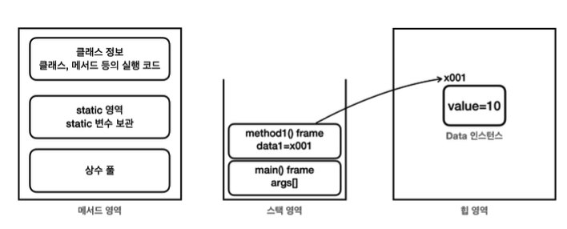
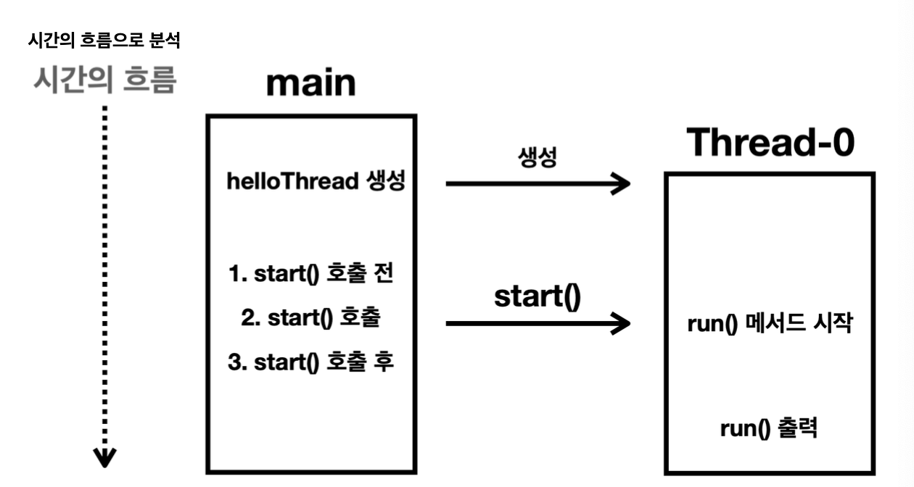

# 3장 - 스레드

### 3장에서는 스레드 생성에 대해 다룬다

### 목차

1. [JVM과 스레드의 관계](#jvm과-스레드의-관계)
2. [스레드 생성 - 상속](#스레드-생성---상속-방식)
3. [스레드 종류](#스레드-종류)
4. [스레드 생성 - 구현](#스레드-생성---구현-방식)
5. [로거 만들기](#로거-만들기)

# JVM과 스레드의 관계

### JVM (Java Virtual Machin)

- 자바 프로그램이 실행되는 가상의 운영체제(가상 컴퓨터)
- 즉 자바 코드를 운영체제 위에서 바로 실행할 수 없기 때문에 JVM이 중간에서 자바 바이트코드(.class)를 읽고 실행해주는 실행환경

JVM 구성요소

- Class Loader : .class파일을 메모리에 적재하는 역할
- Execution Engine(실행엔진) : 로드된 바이트코드를 실제로 실행하는 엔진
- Memory Area(런타임 데이터 영역) : 여기가 자바 메모리 영역

### 메모리 영역의 구조

<p align="left">
    
</p>

- 메서드 영역 : 프로그램 실행에 필요한 공통 데이터를 관리
- 스택 영역 : 자바 실행시 하나의 실행스택이 생성되고 종료시 제거
  - 실행 스택에는 지역변수, 중간연산 결과, 메서드 호출 정보등이 포함된다
- 힙 영역 : 객체(인스턴스)와 배열이 생성되는 영역

### JVM의 메모리 구조를 정리하는 이유?

- 자바 프로그램이 실행될 때 JVM은 main 스레드의 실행 스택을 스택영역에 생성한다
- 이후 추가로 스레드를 생성하면 각각의 스레드마다 독립된 스택이 스택영역에 만들어진다 (main과 같은 스택영역을 사용하는것이 아니다!)

# 스레드 생성 - 상속 방식

자바에서는 스레드도 객체로 다룬다

```java
public class HelloThread extends Thread {
	@Override
	public void run() {
		System.out.println(Thread.currentThread().getName() + ": run()");
	}
}
```

- Thread클래스를 상속받아서 HelloThread라는 클래스를 생성
- 이때 run()메서드를 재정의하여 해당 스레드가 할 작업을 재정의하면 된다

해당 스레드 사용 예시

```java
public class HelloThreadMain {
	public static void main(String[] args) {
	HelloThread thread = new HelloThread();
	helloThread.start();
	}
}
```

- 앞서 만든 HelloThread객체를 생성하고 start()메서드를 호출하여 사용한다

<p align="left">
    
</p>

- 새로운 스레드를 사용하면 main스레드가 실행시켜주는것이 아니라 main스레드는 start()메서드를 통해 Thread-0에게 코드를 실행하게 하는 것이다
- 이를 통해 알 수 있는 점은 스레드간의 실행순서는 보장하지 않는다
  - 같이 별도로 각각 실행되지만 main스레드 3번이 늦는다면 run()메서드를 통해 실행된 스레드가 먼저 실행될수도 있다는 것이다

결론 : 스레드는 순서와 실행 기간을 모두 보장하지 않는다 이것이 멀티스레드다

---

# 스레드 종류

크게 2가지로 **사용자 스레드**와 **데몬 스레드**로 나눌수 있다

### 사용자 스레드

- 프로그램의 주요 작업을 수행
- 작업이 완료될 때까지 실행된다
- 모든 사용자 스레드가 종료되면 JVM도 종료된다

### 데몬 스레드

- 백그라운드에서 보조적인 작업을 수행
- 모든 사용자 스레드가 종료되었다면 데모스레드 실행 여부와 상관없이 자동으로 모두 종료된다

JVM은 데몬 스레드의 실행완료를 기다리지 않고 종료된다

데몬스레드 사용방법

```java
DaemonThread daemonThread = new DaemonThread();
daemonThread.setDaemon(true);//데몬 스레드를 설정 기본값은 false로 사용자 스레드
daemonThread.start();

    //데몬스레드 선언
    static class DaemonThread extends Thread {

        @Override
        public void run() {
            System.out.println(Thread.currentThread().getName() + ": run()");
            try {
                Thread.sleep(10000); //10초간
            } catch (InterruptedException e) {
                throw new RuntimeException(e);
            }
            System.out.println(Thread.currentThread().getName() + ": run() end");
        }
    }
```

- 똑같이 Thread를 상속받아 사용하며 반드시 try 문으로 InterruptedException을 처리해야한다 Exception으로 클래스단에서 예외를 던지는게 불가능하다

이때 궁금한게 왜 Thraed클래스에 분명 run()메서드를 정의 했는데 실제 사용할때는 thread.run() 이 아닌 thread.start()를 사용하는가?

- run은 스레드 내부에서 스레드가 실제 수행할 코드 부분이고
- start()는 새로운 스레드를 생성하고 그 안에서 run()을 실행하도록 요청 하는 구조이기 때문이다
- 기억해야할점은 **“새로운 스레드 생성 여부”** 이다
  - start()는 새로운 스레드를 생성하고 OS에 실행을 요청
  - run() 직접 호출은 단순히 현재 스레드에서 메서드를 실행하는것

## 스레드를 만들때 2가지 방법

- Thread 클래스를 상속받는 방법
- Runnable을 사용하는 방법 ( 실무에서는 주로 이렇게 사용)

## 잠시 중간 정리

### implement(구현), extends(상속)에 대한 중간 정리

### extends - 클래스 상속

- 하위 클래스가 상위 클래스의 필드(속성)와 메서드(동작)을 물려받는것
- 클래스 → 클래스
- 인터페이스 → 인터페이스

```java
class Animal {
		void eat() {
			System.out.println("먹는다"):
			}
		}
class Dog extends Animal {
	void bark() {
		System.out.println("짖는다");
		}
	}
----------------------------------
Dog d = new Dog();
d.eat();
d.bark();
```

### implements - 인터페이스 구현

- 인터페이스는 규칙이라고 생각
- 인터페이스를 기반으로 구현한다고 기억

```java
interface Flyable {
	void fly();
}
-----------------------
class Bird implement Flyable {
	//재정의를 할경우 @Override 명시
	@Override
	public void fly() {
		System.out.println("새가 난다");
	}
}
```

- **@Override를 명시하는 이유**는 컴파일러가 부모 클래스나 인터페이스에 실제 정의된 메서드인지, 오타나 매개변수 불일치를 잡아주는 역할을 한다

### 주의점

- 자바에서는 다중 상속이 불가능하다
- 구현은 여러개 가능하다

ex

```java
class MyService extends BaseService implements Bean1, Bean2 {}
```

다시 돌아와서 스레드 생성 방법은 크게 2가지로

1. 이전에 진행한 Thread를 직접 상속받아서 구현
2. Runnable 인터페이스를 통해서 구현 (실무에서는 이 방식 사용)

# 스레드 생성 - 구현 방식

Runnable 인터페이스를 구현하는 방법

```java
public class HelloRunnable implements Runnable{

    public void run() {
        System.out.println("runnableThread");
    }
}
```

Runnable 사용

```java
    public static void main(String[] args) {
        HelloRunnable runnable = new HelloRunnable();
        Thread thread = new Thread(runnable);
        thread.start();
    }
```

- 스레드를 사용하고자 하는 클래스에 implements를 통해서 구현
- Thread thread = new Thread(new Test()); 를통해 스레드 생성시 실행할 작업을 생성자로 전달

### 왜 Runnable방식을 사용하는가?

- Thread생성방식의 경우 상속(extends)를 통해서 진행되는데 만약 다른 상속을 받아야 할 경우 자바는 다중 상속을 지원하지 않기 때문에 불가능하다
- 반대로 Runnable을 사용할 경우 다른 클래스를 상속받아도 문제 없으며 Runnable객체를 공유하여 다른 코드에서 재사용 및 스레드와 실행할 작업을 분리하리게 코드의 가독성을 높인다

# 로거 만들기

```java
System.out.println(Thread.currentThread().getName())
```

- 매번 어떤 쓰레드가 어떤 작업을 하는지 출력하기에는 너무 코드가 길다
- 따라서 스레드 용도의 로거 클래스를 만들고 사용하는게 좋다
- 이떄 해당 클래스는 생성용도가 아니므로 추상클래스로 로거 클래스를 만들어서 주로 사용하며 실무에서도 자주 사용한다

```java
public abstract class MyLogger {
	private static final DateTimeFormatter formatter =
	DateTimeFormatter.ofPattern("HH:mm:ss.SSS");

	public static void log(Object obj) {
		String time = LocalTime.now().format(formatter);
		System.out.printf("%s [%9s] %s\n", time,Thread.currentThread().getName(), obj);
	}
}
```

- 앞으로는 MyLogger라는 추상클래스를 통해서 스레드의 로그를 찍을 생각이다

# 여러 스레드 만들기

```java
public class ManyThreadMainV2 {
    public static void main(String[] args) {
        log("main() start");

        HelloRunnable runnable = new HelloRunnable();
        for (int i = 0; i < 100; i++) {
            Thread thread = new Thread(runnable);
            thread.start();
        }

        log("main() end");
    }
}
-------------------------
//결과창
01:18:36.121 [     main] main() start
Thread-6: run()
Thread-3: run()
Thread-9: run()
Thread-0: run()
Thread-1: run()
```

# 다양한 방법의 스레드 생성방법

- 정적 중첩 클래스 - 특정 클래스 안에서만 사용되는 경우
- 익명 클래스 - 특정 메서드 안에서만 사용되는 경우
- 익명 클래스(변수없이 직접 전달)
- 람다 사용하는 방법

1. 정적 중첩 클래스 - 특정 클래스 안에서만 사용되는 경우

   ```java
   public class InnerRunnableMainV1 {
       public static void main(String[] args) {
           log("main() start");

           MyRunnable runnable = new MyRunnable();
           Thread thread = new Thread(runnable);
           thread.start();

           log("main() end");
       }

       //정적 중첩 클래스 사용
       //언제 사용?
       //해당 main클래스 안에서만 사용할 것 같으면 static으로 중첩 클래스를 만들어서 사용한다
       static class MyRunnable implements Runnable {

           @Override
           public void run() {
               log("run()");
           }
       }
   }
   ```

2. 익명 클래스 - 특정 메서드 안에서만 사용되는 경우

   ```java
       public static void main(String[] args) {
           log("main() start");

           //익명 클래스로 사용
           //언제 사용?
           //해당 메서드 안에서만 사용할떄 사용
           Runnable runnable = new Runnable() {
               @Override
               public void run() {
                   log("run()");
               }
           };

           Thread thread = new Thread(runnable);
           thread.start();

           log("main() end");
       }
   ```

3. 익명 클래스(변수없이 직접 전달)

   ```java
       public static void main(String[] args) {
           log("main() start");

           Thread thread = new Thread(new Runnable() {
               @Override
               public void run() {
                   log("run()");
               }
           });
           thread.start();

           log("main() end");
       }
   ```

4. 람다 사용하는 방법

   ```java
   public class InnerRunnableMainV4 {
       public static void main(String[] args) {
           log("main() start");

           //람다 사용
           Thread thread = new Thread(() -> log("run()"));
           thread.start();

           log("main() end");
       }
   }
   ```
