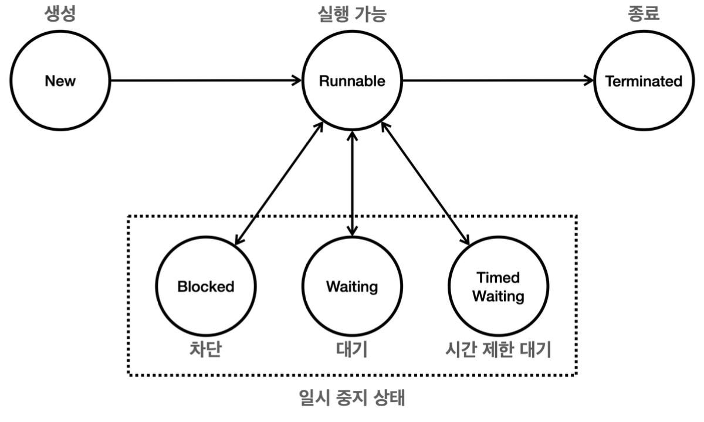

# 4장 - 스레드 제어

### 4장에서는 스레드의 기본정보를 알아본다

### 목차

1. [스레드 기본 정보](#스레드-기본-정보)
2. [스레드의 생명 주기](#스레드의-생명-주기)
3. [스레드의 Join()](#join-파트-시작)

## 스레드 기본 정보

1. 스레드 생성

   ```java
   Thread myThread = new Thread(new HelloRunnable(), "myThread");
   ```

   - Runnable인터페이스를 구현한 HelloRunnable클래스를 통해서 스레드를 생성
   - 이때 2번째 매개변수로 스레드 이름을 “myThread”라고 지정

1. 스레드 객체 정보

   ```java
   log("myThread = " +myThread);
   ```

   - Thread클래스의 기본 toString()메서드를 통해서 출력
   - 결과 : `Thread[#21, myThread, 5, main]`
   - 스레드ID, 스레드이름, 스레드 우선순위, 스레드 그룹이 기본으로 나온다

1. 스레드 ID

   ```java
   log("myThread.threadId() = " + myThread.threadId());
   ```

   - 스레드의 고유 식별자 ID값이 나온다.

1. 스레드 이름

   ```java
   log("myThread.getName() = " + myThread.getName());
   ```

   - myThread라는 스레드 이름을 확인

1. 스레드 우선순위

   ```java
   log(myThread.getPriority() = " + myThread.getPriority());
   ```

   - 우선순위의 기본값은 5, 범위 : 1 ~ 10
   - 우선순위가 높을수록 우선 실행되는 스레드
   - 우선순위가 높더라도 JVM구현과 운영체제에 따라 달라질 수 있다

1. 스레드 그룹

   ```java
   log("myThread.getThreadGroup() = " +myThread.getThreadGroup()):
   ```

   - 1번에서 myThread를 생성할때 main스레드에 의해서 생성 → 부모 스레드는 main이 되며 main이라는 그룹에 소속된다

1. 스레드 상태(제일 중요)

   ```java
   log("myThread.getState() = " + myThread.getState());
   ```

   - NEW : 스레드가 아직 실행되지 않은 상태
   - RUNNABLE : 스레드가 실행중이거나 실행준비가 된 상태
   - BLOCKED : 스레드가 동기화 락을 기다리는 상태
   - WAITING: 스레드가 다른 스레드의 특정 작업을 기다리는 상태(ex: thread.join)
   - TIMED_WAITING : 일정 시간동안 기다리는 상태(ex: thread.sleep())
   - TERMINATED : 스레드가 실행을 마친 상태

---

## 스레드의 생명 주기

<p align="left">
    
</p>

- 자바 스레드의 상태 변화 과정
  1. New → Runnable : start() 메서드를 통해서 Runnable상태로 변화
  2. Runnable → Blocked/Waiting/TimedWaiting → Runnable
  3. Runnable → Terminated
- 한번 종료된 스레드(Terminated)는 다시 시작할 수 없다

---

코드를 통해서 상태를 확인해보기

```java
import static util.MyLogger.*;

public class ThreadStateMain {
    public static void main(String[] args) throws InterruptedException {
        Thread thread = new Thread(new MyRunnable(), "myThread");
        log("myThread.state1 = " + thread.getState());
        log("myThread.start()");
        thread.start();
        Thread.sleep(1000);
        log("myThread.state3 = " + thread.getState()); //TIMED_WAITING
        Thread.sleep(4000);
        log("myThread.state5 = " + thread.getState());// TERMINATED
        log("end");
    }

    static class MyRunnable implements Runnable {
        @Override
        public void run() {
            try {
                log("start");
                log("myThread.state2 = " + Thread.currentThread().getState());//RUNNABLE
                log("sleep() start");
                Thread.sleep(3000);
                log("sleep() end");
                log("myThread.state4 = " + Thread.currentThread().getState());//RUNNABLE
                log("end");
            } catch (InterruptedException e) {
                throw new RuntimeException(e);
            }

        }
    }
}

```

- 결과

```java
22:07:18.369 [     main] myThread.state1 = NEW
22:07:18.370 [     main] myThread.start()
22:07:18.370 [ myThread] start
22:07:18.370 [ myThread] myThread.state2 = RUNNABLE
22:07:18.370 [ myThread] sleep() start
22:07:19.375 [     main] myThread.state3 = TIMED_WAITING
22:07:21.373 [ myThread] sleep() end
22:07:21.374 [ myThread] myThread.state4 = RUNNABLE
22:07:21.375 [ myThread] end
22:07:23.381 [     main] myThread.state5 = TERMINATED
22:07:23.381 [     main] end
```

- 당연한 말이지만 main기준 Thread를 사용하면 main스레드를 지칭
- 따라서 main스레드를 통해서 TIMED_WAITING인 myThread의 상태를 조회한것
- run()메서드는 메서드 안에서 반드시 체크 예외를 잡아야한다
- main문에서는 InterruptedException을 던질 수 있다

---

### 자바의 예외를 간단하게 정리

```java
java.lang.Object
 └── java.lang.Throwable
      ├── Error
      └── Exception
           ├── RuntimeException
           └── (Checked Exception)
```

- Error : 직접 처리할 수 없는 시스템 레벨의 문제
- Exception
  - RuntimeException(런타임)
    - 실행중에 발생하며, 컴파일러가 예외처리를 강제하지 않음
  - CheckedException(컴파일 시점)
    - 컴파일러가 반드시 예외처리를 강제

### 갑자기 예외를 왜 정리하냐?

- 자바에서 체크예외는 부모 메서드가 체크예외를 던지지 않는 경우 재정의된 자식 메서드도 체크 예외를 던질 수 없다

우리가 사용하는 Runnable인터페이스 코드를 보면

```java
/**
 * Represents an operation that does not return a result.
 *
 * <p> This is a {@linkplain java.util.function functional interface}
 * whose functional method is {@link #run()}.
 *
 * @author  Arthur van Hoff
 * @see     java.util.concurrent.Callable
 * @since   1.0
 */
@FunctionalInterface
public interface Runnable {
    /**
     * Runs this operation.
     */
    void run();
}
```

- 자바 1.0때 만들어졌고
- run()메서드에는 전혀 예외처리를 하고 있지 않다
- 따라서 우리가 재정의하는 run()메서드에서 throws를 할 수 없고 반드시 try-catch 문을 통해서 체크 예외를 처리해야 한다.

---

### Join 파트 시작

```java
public class JoinMainV0 {
    public static void main(String[] args) {
        log("start");
        Thread thread1 = new Thread(new Job(), "thread1");
        Thread thread2 = new Thread(new Job(), "thread2");

        thread1.start();
        thread2.start();
        log("end");
    }

    static class Job implements Runnable {
        @Override
        public void run() {
            log("작업 시작");
            sleep(2000);
            log("작업 완료");
        }
    }
}
```

- 해당 코드의 실행 결과로그를 보면
- main쓰레드는 Thread1, Thread2생성과 실행만 할 뿐 기다리지 않는다
- 쓰레드 순서는 항상 다르겠지만 나온 결과를 보면 main이 먼저 종료가 되고 Thread1, 2 가 실행후 종료된걸 볼 수 있다

## 그렇다면 메인 스레드가 생성된 스레드의 작업을 기다려야 하는 상황이라면 어떻게 해야할까?

- 실습에서는 Main 스레드의 sleep()시간을 조정하여 작성
  - 하지만 이 방식은 정확한 타이밍을 기다릴 수 없다
- 그렇다면 Thread1,2의 상태값을 기준으로 확인할까?
  - 그러면 Main스레드에서 while문으로 Thread1,2의 스레드 상태값이 `TERMINATED` 가 될때까지 돌린다?
  - 이또한 계속 연산을 돌리기 때문에 비효율적이다
- join()을 활용하자!
  - thread1.join() 이라면 main스레드는 thread1의 상태가 TERMINATED 된 시점까지 기다리게 된다
- join(ms)
  - join()메서드의 오버로딩 메서드로 매개변수에 기다릴 ms값을 넣으면 된다
  - 스레드의 작업을 무한정 기다릴 수 없을때는 join의 오버로딩을 통해서 기다릴 시간을 지정하여 사용하면 된다
  - ex) thread1.join(1000); thread1의 작업을 1초만 기다린다

### 오버로딩과 오버라이딩 정리

|           | **오버로딩 (Overloading)**                                                               | **오버라이딩 (Overriding)**                               |
| --------- | ---------------------------------------------------------------------------------------- | --------------------------------------------------------- |
| 정의      | 같은 클래스 내에서 같은 이름의 메서드의 매개변수(타입,개수, 순서)를 다르게 정의하여 사용 | 상속 관계에서 부모 클래스의 메서드를 자식 클래스가 재정의 |
| 발생 위치 | 같은 클래스 내                                                                           | 상속된 클래스 간                                          |
| 반환 타입 | 달라도 무관                                                                              | 같거나 하위 타입                                          |
