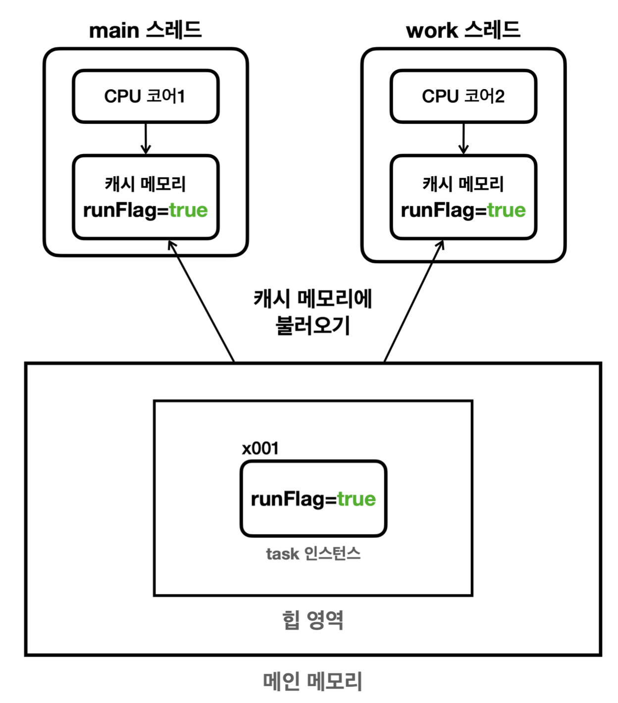
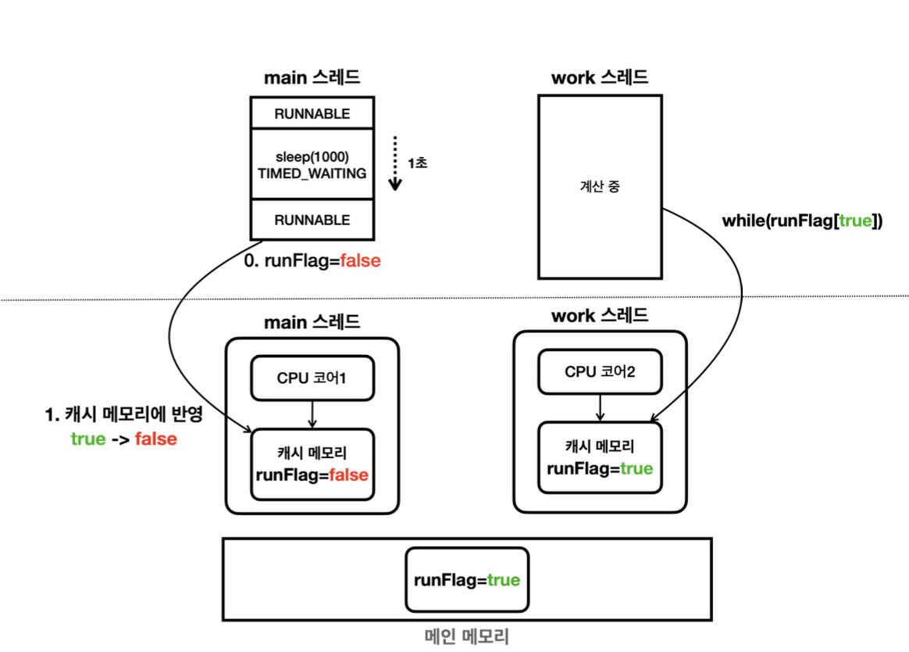

# 6장 - 스레드 제어

### 6장에서는 메모리 가시성에 대해 알아본다

### 목차

1. [스레드의 메모리 접근](#스레드의-메모리-접근-구조)
2. [메모리 가시성?](#메모리-가시성-정의)
3. [자바 메모리 모델](#자바-메모리-모델java-memory-model)
4. [정리](#이번-장을-진행하며-정리)

실습에 진행한 일부 코드

```java

public static void main(String[] args) {
    MyTask task = new MyTask();
    Thread t = new Thread(task, "work");
    log("runFlag = " + task.runFlag);
    t.start();
    sleep(1000);
    log("runFlag를 false로 변경 시도");
    task.runFlag = false;
    log("runFlag = " + task.runFlag);
    log("main 종료");
}

static class MyTask implements Runnable {

    boolean runFlag = true;
    //        volatile boolean runFlag = true;
    @Override
    public void run() {
        log("task 시작");
        while (runFlag) {
            //runFlag가 false로 변하면 탈출

        }
        log("task 종료");
    }
}
```

- 해당 코드를 보면 runFlag값이 false가 되었을때 work 스레드도 while문을 종료하고 task가 종료되기를 기대했지만 그렇지 않는 결과를 볼 수 있다
- 분명 `log("runFlag = " + task.runFlag);` 를 통해 확인하면 Flag값이 false로 변경된걸 볼 수 있는데 왜 그럴까?

이해하기 위해서 스레드가 메모리에 접근하는 구조를 이해해야 한다

# 스레드의 메모리 접근 구조

<p align="left">
    
</p>

- 우선 runFlag 라는 변수의 값은 메인 메모리에 저장
- 하지만 메인메모리는 CPU 입장에서 보면 거기가 멀고, 상대적으로 느리다
- 따라서 CPU 가까이에 있는 빠른 메모리인 캐시 메모리를 각 스레드마다 사용하게 되며 캐시 메모리에 해당 변수를 저장
- 현대의 CPU 대부분은 코어 단위로 캐시 메모리를 가진다
- 이후 각 스레드가 runFlag값을 사용하면 CPU는 효율적으로 처리하기 위해서 runFlag를 캐시 메모리에 저장한 뒤 사용하게 된다

<p align="left">
    
</p>

- 문제는 main스레드가 runFlag값을 false로 바꾸더라도 메인 메모리의 runFlag값에 반영되는 것이 아닌 main스레드의 캐시 메모리의 runFlag값에만 변경이 되어 work스레드의 작업이 종료되지 않았던 것이다

# 메모리 가시성 정의

- 이처럼 멀티스레드 환경에서 한 스레드가 변경한 값이 다른 스레드에서 언제 보이는지에 대한 문제를 메모리 가시성 이라 한다

그렇다면 runFlag와 같이 다른 스레드에서도 확인해야 하는 변수는 어떻게 처리해야할까?

### Voatile 적용


volatile이라는 키워드를 사용하여 변수를 사용하면 된다

→ volatile이 붙은 변수는 캐시메모리에 저장하지 않고 메인메모리를 통해서만 저장하고 읽게 된다

→ 이럴 경우 당연히 캐시메모리의 접근 속도 향상 이라는 장점을 가질 수 없어 필요한 공통으로 접근해야하는 변수에 사용하는 것이 좋다

# 자바 메모리 모델(Java Memory Model)

- 이전에 메모리 가시성을 다루며 다른 스레드에서 메모리에 변경한 값이 보이는가 보이지 않는가에 대해 다뤘다
- 그렇다면 자바에서는 메모리에 어떻게 접근하고 수정할 수 있는지를 알아야 하는데 이를 규정한 것이 바로 **자바 메모리 모델**이다
- happens-before 관계는 자바 메모리 모델에서 스레드 간의 작업 순서를 정의한 개념이다

### happens-before

- 한 동작이 다른 동작보다 먼저 발생함을 보장
- 스레드 간의 메모리 가시성을 보장하는 규칙
- happens-before 관계가 성립하면 한 스레드의 작업을 다른 스레드에서 볼 수 있게 된다

### happens-before가 발생하는 경우

- 프로그램 순서 규칙 - 단일 스레드 상황에서는 코드 순서대로 문제 없이 동작
- volatile 변수 규칙 - `volatile` 변수를 읽을때는 그전에 쓰기가 반영된 값을 읽음
- 스레드 시작 규칙 - `start()` 호출전 그전 작업을 메모리 데이터를 확인가능
- 스레드 종료 규칙 -`join()` 호출 후에는 스레드의 모든 작업이 완료된 값을 읽어야함
- 인터럽트 규칙 - `interrupt()`를 걸면 인터럽트 상태를 먼저 확인하여 즉시 종료가 가능
- 객체 생성 규칙 - 객체는 생성된 후에만 참조될 수 있도록 보장
- 모니터 락 규칙 - `synchronized`블록 종료 후 변경된 값을 확인할 수 있다
- 전이 규칙 - A → B , B → C 면 A → C이다

이런 규칙들은 외우는게 아니라 이해 하며 volatile 또는 스레드 동기화 기법(`synchronized, ReentrantLock`)을 사용하면 메모리 가시성 문제가 발생하지 않는다 가 핵심이다

# 이번 장을 진행하며 정리

- 일반적으로 메인 메모리를 통해서 변수에 접근할 줄 알았지만 CPU코어마다 캐시메모리가 존재한다 캐시 메모리에는 각 변수를 저장하고 빠르게 사용한다
- 메모리 가시성 : 멀티스레드 환경에서 한 스레드의 반영값이 다른 스레드에서 언제 보이는가?
  - 이를 해결하기 위해 volatile을 사용 → 캐시메모리를 사용하지 않고 메인 메모리를 사용한다 → 성능 저하가 발생할 수 있다
- 자바 메모리 모델 : 자바에서 어떻게 메모리에 접근하고 읽고 수정하는지에 대한 정의
- happens-before 의 핵심 : 메모리 가시성 문제가 있다면 volatile or 스레드 동기화 기법으로 메모리 가시성 문제를 해결한다
