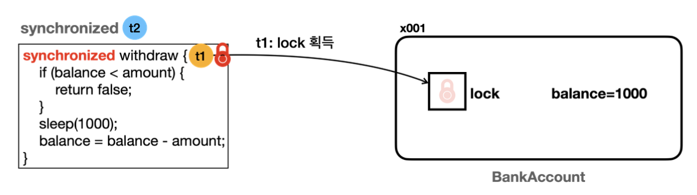

# 7장 - 동기화 synchronized

### 7장에서는 동시성 문제를 해결하는 예제 진행

### 목차

1. [동시성 출금 예제](#동시성-출금-예제)
2. [임계영역(Critical Section)?](#임계영역critical-section이란)
3. [Synchronized 구조](#synchronized-구조-이해)
4. [정리](#이번-장을-진행하며-정리)

# 동시성 출금 예제

계좌 출금과 조회 일부 코드

```java
@Override
public boolean withdraw(int amount) {
    log("거래 시작: " + getClass().getSimpleName());
    //잔고가 출금액 보다 적으면, 안됨
    log("[검증 시작] 출금액: " + amount + ", 잔액: " + balance);

    if (balance < amount) {
        log("[검증 실패] 출금액: " + amount + ", 잔액: " + balance);
        return false;
    }

    log("[검증 완료] 출금액: " + amount + ", 잔액: " + balance);
    sleep(1000); //출금에 걸리는 시간으로 가정
    balance = balance - amount;
    log("[출금 완료] 출금액: " + amount + ", 잔액: " + balance);

    log("거래 종료 ");
    return true;
}

@Override
public int getBalance() {
    return balance;
}
```

- BankAccountV1 코드의 일부

```java
BankAccount account = new BankAccountV1(1000);

Thread t1 = new Thread(new WithdrawTask(account, 800), "t1");
Thread t2 = new Thread(new WithdrawTask(account, 800), "t2");
        t1.start();
        t2.start();

sleep(500); //검증까지 잠시 대기
log("t1 state: "+ t1.getState());
log("t2 state: "+ t2.getState());

        t1.join();
        t2.join();

log("최종 잔액: " + account.getBalance());
```

- 실제 실행될 Main문의 코드 일부
- 계좌의 출금과 조회 전용 스레드를 통하여 진행

### 실행 결과

```java
21:22:20.001 [     main] t1 state: RUNNABLE
21:22:20.001 [       t1] 거래 시작: BankAccountV1
21:22:20.001 [       t2] 거래 시작: BankAccountV1
21:22:20.002 [     main] t2 state: WAITING
21:22:20.005 [       t1] [검증 시작] 출금액: 800, 잔액: 1000
21:22:20.005 [       t2] [검증 시작] 출금액: 800, 잔액: 1000
21:22:20.005 [       t2] [검증 완료] 출금액: 800, 잔액: 1000
21:22:20.005 [       t1] [검증 완료] 출금액: 800, 잔액: 1000
21:22:21.008 [       t2] [출금 완료] 출금액: 800, 잔액: 200
21:22:21.008 [       t1] [출금 완료] 출금액: 800, 잔액: -600
21:22:21.010 [       t1] 거래 종료
21:22:21.009 [       t2] 거래 종료
21:22:21.011 [     main] 최종 잔액: -600
```

- 분명 출금전 검증 로직이 있음에도 왜 이런 문제가 발생하였는가?

### 결과 분석

1. t1스레드가 검증을 진행하는 사이에 t2스레드 또한 검증을 진행한다
2. 그렇다 보니 t1, t2스레드 둘다 잔액은 1000원으로 확인 후 출금이 되어 문제가 발생한다

지금 withdraw() 메서드를 실행할때 하나의 스레드만 수행할 수 있게 하여 임게 영역을 보호하는 방법을 생각해보자

# 임계영역(critical section)이란?

- 여러 스레드가 동시에 접근 시 문제가 될 수 있는 공유 자원을 다루는 코드 부분

방금 진행한 코드에서는

```java
출금() {
	잔액 조회
	잔액 출금
}
```

잔액을 조회하고, 출금하는 부분에서 여러 스레드가 접근이 가능하기에 문제가 발생했고 이 부분이 임계영역이다

### 그렇다면 임계영역 문제를 어떻게 해결할까?

해당 임계영역을 하나의 스레드만 접근가능하도록 해야하는데 자바에서는 여러 방법중 `synchronized` 키워드를 통해 보호가 가능하다

```java
    @Override
    public synchronized boolean withdraw(int amount) {
    ...
    }

    @Override
    public synchronized int getBalance() {
        return balance;
    }
```

- `synchronized` 키워드를 통해서 하나의 스레드만 메서드에 접근가능하게 한다

# Synchronized 구조 이해

<p align="left">
    
</p>

> 모든 객체(인스턴스)는 내부에 자신만의 락을 가진다
> synchronzied 메서드에 진입하기 위해선 해당 인스턴스의 락이 필요

작동 순서 예시 - t1 스레드가 먼저 실행되었다 가정

1. t1스레드가 락을 획득
2. t1이 메서드를 실행하고, t2는 락이 없으므로 BLOKED 상태로 변하며 이때 CPU는 사용 안함
3. BLOCKED상태는 락을 획득 할 때까지 무한정 대기한다
4. t1의 메서드 호출이 끝나면 락을 반납
5. 이후 t2가 락을 획득하여 메서드 실행 및 종료

참고 : `synchronized` 안에서 접근하는 변수는 `volatile`을 사용하지 않아도 메모리 가시성 문제가 해결된다

### Synchronized 블럭단위 적용

- 기존에는 메서드 단위로 `synchronized`를 적용하여 메서드 접근 자체를 막았다
- 하지만 멀티 스레드 상황에서 메서드 안에서도 동시 접근이 가능한 부분이 있다면 너무 비효율적인 상황이다
- `Synchronized` 키워드는 블럭단위로도 사용이 가능하다

```java
public boolean withdraw(int amount) {
	//공통 접근 가능한 로직
	synchronized(this) {
	//임계영역 로직
	}
	...
}
```

- 이전과 다른점은 `withdraw()` 메서드에 `synchronized`를 사용하는 것이 아닌 필요한 로직에 적용한 점
- `synchronized(this) {}` 는 해당 인스턴스에서 락을 가져와 사용

# 이번 장을 진행하며 정리

### synchronized 장점

- synchronized 키워드를 통한 편리한 사용
- 자동 잠금 해제 : 직접 락 대기, 해제 관여할 필요가 없다

### synchronized 단점

- 무한 대기 : `BLOCKED` 상태의 스레드는 락이 풀릴 때 까지 무한정 대기
- 공정성 : 락이 풀렸을때 `BLOCKED`상태의 스레드중 어떤 스레드가 실행될지 알 수 없다
- 이런 문제를 해결하기 위해 `java.util.concurrent` 라는 동시성 문제 해결을 위한 패키지가 자바 1.5때 추가되었고 요즘은 이걸 사용하는 추세이다

### synchronized 도입 위치

- 공유 자원에 여러 스레드가 접근하는 장소
- **주의 할점**은 **지역변수**는 어차피 **각 스레드의 메모리에 저장**되기에 다른 스레드와 공유되지 않으므로 오히려 성능 저하 문제가 발생할 수 있다
