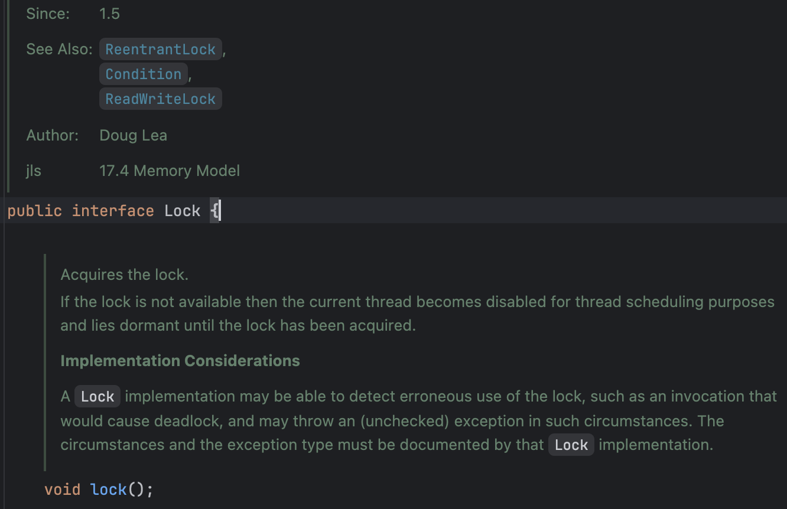
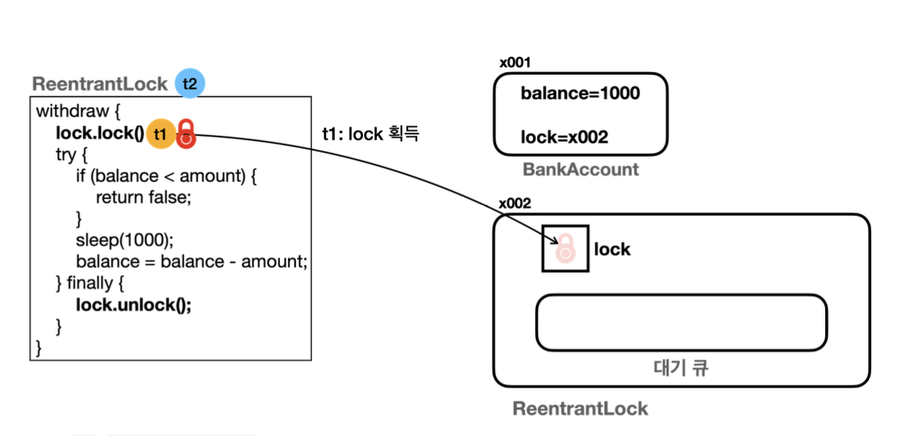
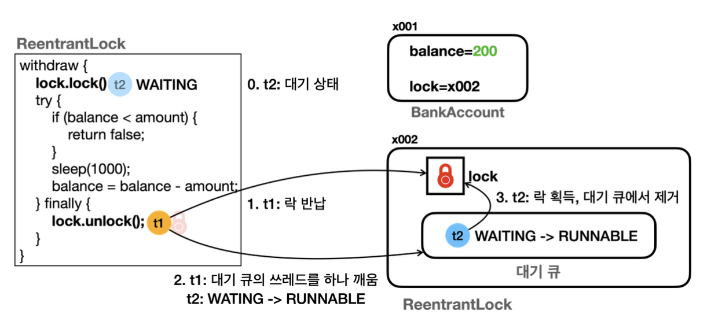

# 8장 - 동기화 ReentrantLock

### 8장에서는 LockSupport의 대표 구현체 ReentrantLock 학습

### 목차

1. [LockSupport 개요](#동시성-출금-예제)
2. [ReentrantLock - 이론](#reentrantlock---이론)
3. [ReentrantLock - 활용](#reentrantlock---활용)
4. [정리](#이번-장을-진행하며-정리)

# LockSupport 개요

- 기존의 `synchronized` 단점
- 무한 대기 : `BLOCKED` 상태의 스레드는 락이 풀릴 때 까지 무한 대기
- 공정성 : 락이 돌아왔을때 어떤 스레드가 락을 획득할지 알 수 없다

이런 문제를 해결하기 위해서 자바 1.5부터 java.util.concurrent 라는 동시성 문제 해결을 위한 라이브러리가 추가

### LockSupport 대표 기능

`park()` : 스레드를 WAITING 상태로 변경

`parkNanos(nanos)` : 스레드를 나노초 동안 TIMED_WAITING 상태로 변경

`unpark(thread)` : WAITING 상태의 대상 스레드를 RUNNABLE 상태로 변경

### 상태 정리

- WAITING과 TIMED_WAITING의 차이점은 대기시간을 지정할 수 있는 차이이다
- BLOCKED 상태는 synchronized에서만 사용하는 특별한 대기 상태이다
- 3가지 상태 모두 대기 상태로 실행 스케쥴링에 들어가지 않기에 CPU입장에서는 비슷한 상태이다
- WAITING 상태는 unpark()과 interrupt를 통해서 RUNNABLE 상태로 돌아갈 수 있다
- BLOCKED 상태는 인터럽트가 동작하지 않는다, 락 획득까지 무한정 대기

### 그럼 synchronized 대신 LockSupport를 통해 직접 락을 구현한다?

> LockSupport는 너무 저수준이다.
> 여러 스레드중 하나의 스레드만 락을 가지게 만들어야 하고, 락을 대기할때 스레드를 저장할 자료구조 필요, 락이 풀렸을때는 어떤 우선순위로 락을 획득할지 등 너무 많은 작업이 필요하다

### 그래서 나온게 ReentrantLock이다!

# ReentrantLock - 이론

- 자바 1.0부터 존재한 synchronized의 무한대기, 공정성 문제를 해결하기 위해 자바 1.5부터 Lock인터페이스와 ReentrantLock 구현체를 제공한다
- Lock인터페이스의 대표적인 구현체가 ReentrantLock이다

<p align="left">
    
</p>

### Lock 인터페이스에서 제공되는 주요 메서드

```java
public interface Lock {
	void lock();
	void lookInterruptibly() throws InterruptedException;
	boolean tryLock();
	boolean tryLock(long time, TimeUnit unit) throws InterruptedException;
	void unlock();
	Condition new Condition();
}
```

- `void lock()`

  - 락을 획득
  - 이미 다른 스레드가 락을 획득한 상태라면 대기(WAITING)
  - 인터럽트에 응답하지 않는다

- `void lockInterruptibly()`

  - 락 획득, 이과정에서 다른 스레드가 인터럽트할 수 있도록 함
  - 인터럽트가 발생시 InterruptedException이 발생하며 락 획득 포기
  - 이미 다른 스레드가 락을 획득한 상태라면 대기(WAITING)

- `boolean tryLock()`

  - 락 획득 시도 후 성공 여부를 반환
  - 락 획득 성공시 true
  - 락 획득 실패시 false를 반환하고 포기

- `boolean tryLock(long time, TimeUnit unit)`

  - 주어진 시간동안 락 획득을 시도, 시간안에 락 획득 실패시 포기
  - 성공시 true, 실패시 false
  - 대기중에 인터럽트 발생시 InterruptedException발생하며 포기

- `void unlock()`

  - 락을 해제한다
  - 락을 획득하지 않은 스레드가 호출시 IllegalMonitorStateException이 발생

- `Condition newCondition()`
  - Condition 객체를 생성하여 반환
  - Condition 객체는 락과 결합되어 사용되며 스레드가 특정 조건을 기다리거나 신호를 받을 수 있도록 한다

### 공정성 해결 방식

ReentrantLock에서는 스레드가 공정하게 락을 획득하게 지정할 수 있다

```java
//비공정 모드 락
private final Lock nonFairLock = new ReentranLock();

//공정 모드 락
private final Lock fairLock = new ReentrantLock(true);
```

### 비공정 모드

- ReentrantLock의 기본모드
- 락을 획득하는 속도가 빠름
- 특정 스레드가 계속해서 락을 획득하지 못할 수 있다

### 공정 모드

- new ReentrantLock(true)
- 대기큐를 활용해 먼저 대기한 스레드가 락을 획득한다
- 락을 획득하는 속도가 느려져 성능저하가 생길 수 있다

### 그럼 어떤걸 쓰냐?

- 비공정 모드도 내부에 큐를 사용하지만 갑자기 새로운 스레드가 들어올때 문제가 생기는 정도로 기본적으로는 순서대로 시작된다
- 비즈니스 상황에서 순서가 정말 중요한 경우가 아니라면 비공정 모드를 사용해도 된다

### 정리

이로써 synchronized의 무한대기 상태와 공정성 문제를 Lock인터페이스와 구현체인 ReentrantLock을 통해서 해결이 가능했다

# ReentrantLock - 활용

- 이전의 출금 예제 코드를 synchronized가 아닌 ReentrantLock을 활용하도록 변경

```java
@Override
public boolean withdraw(int amount) {
    log("거래 시작: " + getClass().getSimpleName());

    lock.lock();
    try {
        log("[검증 시작] 출금액: " + amount + ", 잔액: " + balance);
        if (balance < amount) {
            log("[검증 실패] 출금액: " + amount + ", 잔액: " + balance);
            return false;
        }

        log("[검증 완료] 출금액: " + amount + ", 잔액: " + balance);
        sleep(1000); //출금에 걸리는 시간으로 가정
        balance = balance - amount;
        log("[출금 완료] 출금액: " + amount + ", 잔액: " + balance);
        //임계영역 종료
    } finally {
        lock.unlock();
    }
    log("거래 종료: ");
    return true;
}
```

실행 결과 로그

```java
18:45:32.308 [       t1] [검증 시작] 출금액: 800, 잔액: 1000
18:45:32.308 [       t1] [검증 완료] 출금액: 800, 잔액: 1000
18:45:32.801 [     main] t1 state: TIMED_WAITING
18:45:32.801 [     main] t2 state: WAITING
18:45:33.314 [       t1] [출금 완료] 출금액: 800, 잔액: 200
18:45:33.315 [       t1] 거래 종료:
18:45:33.315 [       t2] [검증 시작] 출금액: 800, 잔액: 200
18:45:33.316 [       t2] [검증 실패] 출금액: 800, 잔액: 200
18:45:33.317 [     main] 최종 잔액: 200
```

### 결과 분석

- t1의 상태가 TIMED_WAITING인 이유는 락을 획득하고 내부 로직에서 sleep() 상태이기에 TIMED_WAITING
- t2의 상태는 t1의 락 반납을 대기하는 상태이므로 WAITING

### 결과 구조 분석

<p align="left">
    
</p>

> t1이 먼저 실행된다는 가정하에 ReentrantLock의 락을 획득하여 코드를 실행
> 이후 t2는 락이 없기 떄문에 대기 큐에서 대기한다

<p align="left">
    
</p>

> t1이 실행을 마치고 락을 반납
> 이때 내부적으로 LockSupport.unpark(t2Thread)가 실행
> t2스레드는 락을 획득하고 실행하게 된다

**주의** : 이때 말하는 락은 **인스턴스가 가지는 락(모니터 락)이 아닌** **ReentrantLock이 제공하는 락이다**

# 이번 장을 진행하며 정리

- 자바 1.0의 `synchronized` 단점인 무한대기, 공정성 문제를 해결하기 위해 자바 1.5의 `LockSupport`가 추가되었다 대표적인 락 구현체로 `ReentrantLock`이 존재
- `ReentrantLock`에서는 `tryLock()`을 통해 무한 대기 해결과
  자체 대기 큐를 활용하여 공정성 문제를 해결할 수 있다
- `Lock lock = new ReentrantLock(true);`를 통해 **공정 모드**를 설정 가능
  하지만 공정모드는 **성능 저하**가 발생 가능하며
  비공정 모드라도 대기 큐를 활용하지만 새로운 스레드와 같은 특별한 상황이 아니라면 순서대로 진행되므로
  비지니스 요구 상황에 맞게 사용
- **사용시 주의점**은 `Lock.lock()`을 통해 락을 획득한 뒤에는 반드시 락을 반납해야한다
  따라서 `try-finally`에서 `lock.unlock()`을 반드시 해줘야 한다
