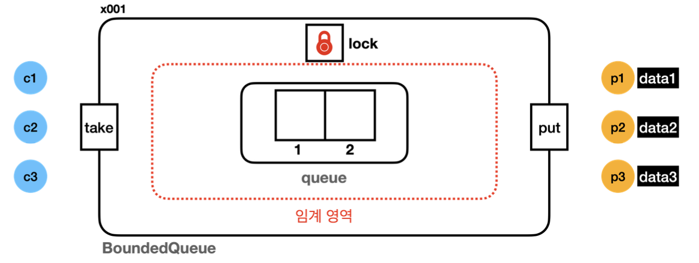
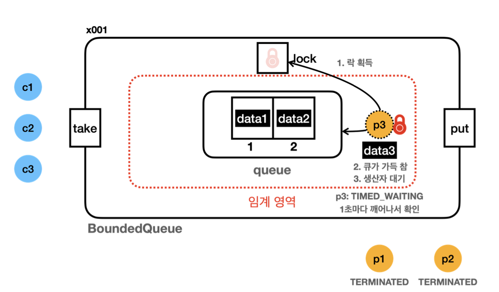
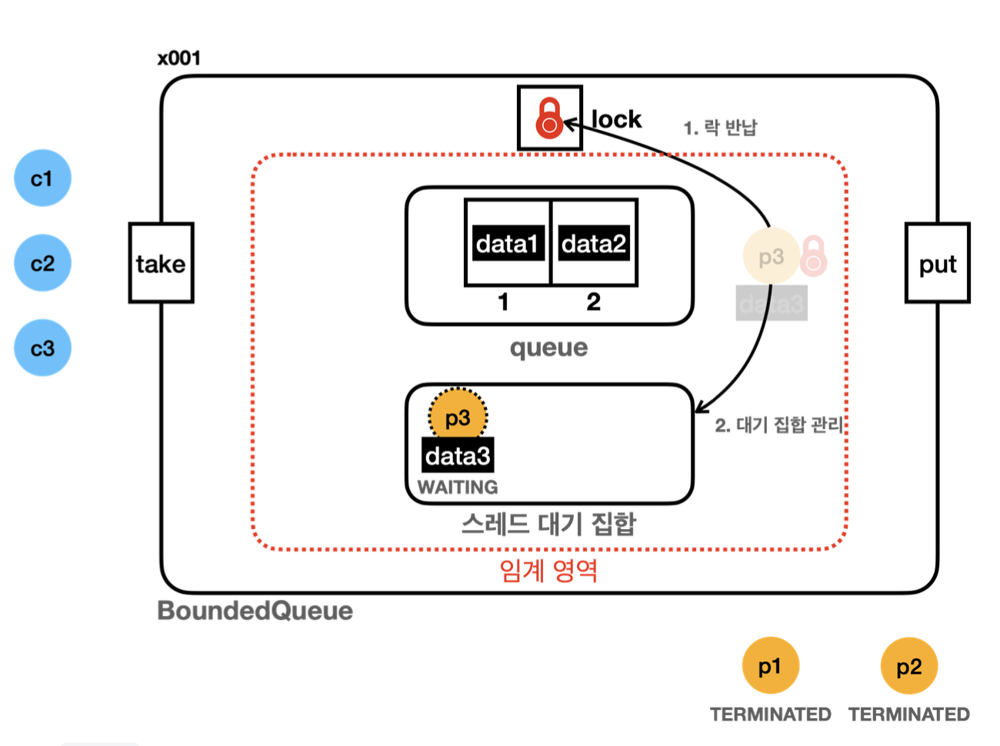
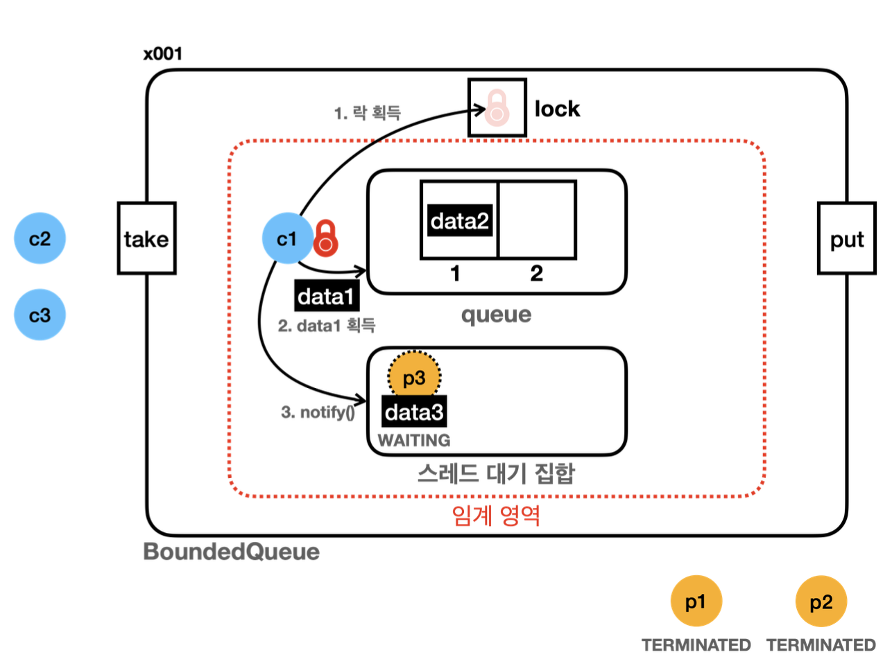
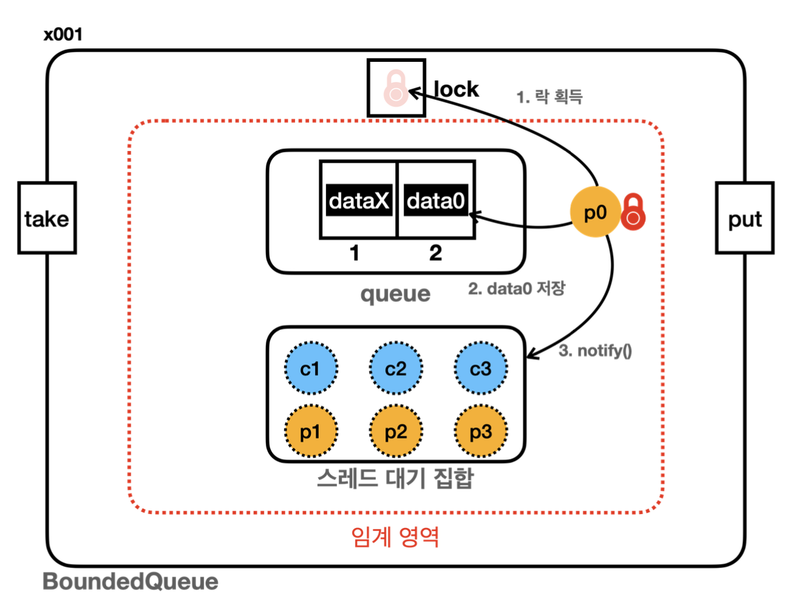
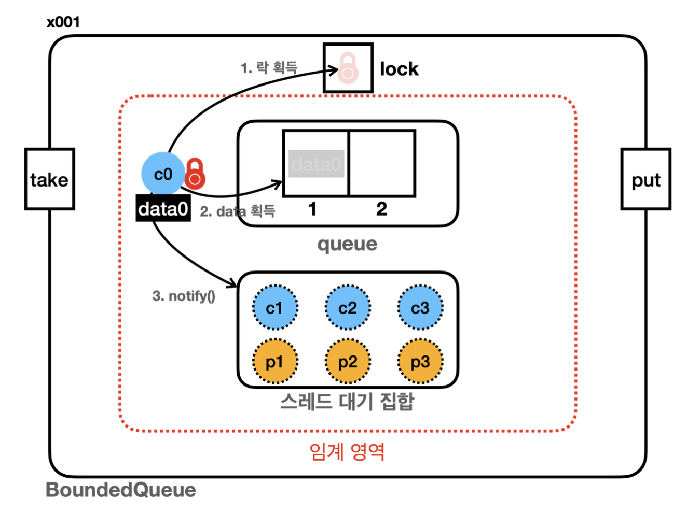
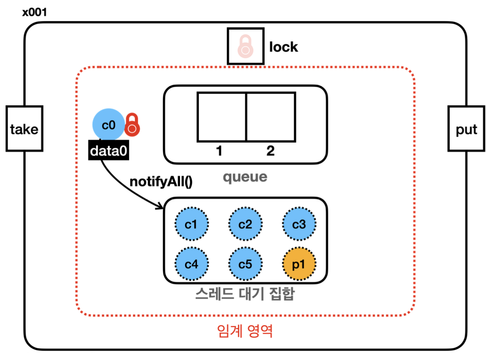

# 9장 - 생산자 소비자 문제

### 9장에서는 생산자 소비자 문제의 해결과정을 진행한다

### 목차

1. [생산자 소비자 문제란?](#생산자-소비자-문제란)
2. [해결과정 - v1](#생산자-소비자-문제-예제-코드-진행---v1)
3. [해결과정 - v2](#생산자-소비자-문제-예제-코드-진행---v2)
4. [해결과정 - v3](#생산자-소비자-문제-예제-코드-진행---v3)
5. [wait()와 notify()의 한계](#object---wait-notify-한계)
6. [정리](#이번-장을-진행하며-정리)

# 생산자 소비자 문제란?

생산사 소비자 문제는 멀티스레드 프로그래밍에서 자주 등장하는 동시성 문제 중 하나이다

### 기본 개념

- 생산자
  - 데이터를 생성하는 역할
  - 파일에서 데이터를 읽어오거나 네트워크에서 데이터를 받아오는 스레드가 생산자 역할
- 소비자
  - 생성된 데이터를 사용하는 역할
  - 데이터를 처리하거나 저장하는 스레드가 소비자 역할
- 버퍼
  - 생산자가 생성한 데이터를 일시적으로 저장하는 공간
  - 버퍼는 한정된 크기를 가지며 소비자가 이 버퍼를 통해 데이터를 주고 받는다

### 문제 상황

- 생산자가 너무 빠를때 : 버퍼가 가득 차서 더 이상 데이터를 넣을 수 없을 때까지 생산자가 데이터를 생성한다
- 소비자가 너무 빠를때 : 버퍼가 비어서 소비자가 더이상 소비할 데이터가 없어 버퍼에 새로운 데이터가 들어올 때까지 기다린다

# 생산자 소비자 문제 예제 코드 진행 - v1

일부 코드를 통해 정리했습니다

버퍼는 큐를 활용하여 main문에서 크기가 2인 버퍼를 사용한다 가정

```java
public class BoundedQueueV1 implements BoundedQueue{

    private final Queue<String> queue = new ArrayDeque<>();
    private final int max; //버퍼 최대 용량

    public BoundedQueueV1(int max) {
        this.max = max;
    }

    @Override
    public synchronized void put(String data) {
        if (queue.size() == max) {
            log("[put] 큐가 가득 참, 버림: " + data);
            return;
        }
        queue.offer(data);
    }

    @Override
    public synchronized String take() {
        if (queue.isEmpty()) {
            return null;
        }
        return queue.poll();
    }

    @Override
    public String toString() {
            return queue.toString();
    }
}
```

- 생산자가 큐에 데이터를 넣기위한 put() 메서드
- 소비자가 데이터를 가져가기 위한 take() 메서드
- 큐에 남은 데이터를 확인하기 위한 toString()메서드 재정의

main문 코드 일부

```java
public static void main(String[] args) {
    //1. BoundedQueue 선택
    BoundedQueue queue = new BoundedQueueV1(2);

    //2.생산자 소비자 실행 순서 선택, 반드시 하나만 선택
        producerFirst(queue); //생산자 먼저 실행
    //consumerFirst(queue); //소비자 먼저 실행
}

private static void producerFirst(BoundedQueue queue) {
    log("== [생산자 먼저 실행]  시작, " + queue.getClass().getSimpleName() + " ==");
    List<Thread> threads = new ArrayList<>();
    startProducer(queue, threads);
    printAllState(queue, threads);
    startConsumer(queue, threads);
    printAllState(queue, threads);
    log("== [생산자 먼저 실행] 종료, " + queue.getClass().getSimpleName() + " ==");
}
```

- `producerFirst`와 `consumerFirst` 메서드를 통해 생산자와 소비자 둘중 하나가 먼저 접근하게 작성
- `startProducer`, `startConsumer` 메서드를 통해 데이터를 넣고, 가져가기 이때 각 스레드는 3개씩 진행
- `printAllState`를 통해 각 스레드의 상황을 체크

### 생산자 소비자 문제 예제1 분석 - 생산자 우선

<p align="left">
    
</p>

```java
10:59:17.983 [     main] 생산자 시작
10:59:17.987 [producer 1] [생산 시도] data1 -> []
10:59:17.987 [producer 1] [생산 완료] data1 -> [data1]
10:59:18.090 [producer 2] [생산 시도] data2 -> [data1]
10:59:18.090 [producer 2] [생산 완료] data2 -> [data1, data2]
10:59:18.195 [producer 3] [생산 시도] data3 -> [data1, data2]
10:59:18.196 [producer 3] [put] 큐가 가득 참, 버림: data3
10:59:18.196 [producer 3] [생산 완료] data3 -> [data1, data2]

10:59:18.301 [     main] 현재 상태 출력, 큐 데이터: [data1, data2]
10:59:18.301 [     main] producer 1: TERMINATED
10:59:18.301 [     main] producer 2: TERMINATED
10:59:18.301 [     main] producer 3: TERMINATED

10:59:18.301 [     main] 소비자 시작
10:59:18.302 [consumer1] [소비 시도]     ? <- [data1, data2]
10:59:18.302 [consumer1] [소비 완료]data1 <- [data2]
10:59:18.403 [consumer2] [소비 시도]     ? <- [data2]
10:59:18.403 [consumer2] [소비 완료]data2 <- []
10:59:18.504 [consumer3] [소비 시도]     ? <- []
10:59:18.504 [consumer3] [소비 완료]null <- []

10:59:18.609 [     main] 현재 상태 출력, 큐 데이터: []
10:59:18.609 [     main] producer 1: TERMINATED
10:59:18.609 [     main] producer 2: TERMINATED
10:59:18.609 [     main] producer 3: TERMINATED
10:59:18.610 [     main] consumer1: TERMINATED
10:59:18.610 [     main] consumer2: TERMINATED
10:59:18.610 [     main] consumer3: TERMINATED
10:59:18.610 [     main] == [생산자 먼저 실행] 종료
```

1. 생산자는 큐(버퍼)에 데이터를 넣기 위해 락을 획득 후 저장
2. 하지만 3번째 데이터는 가득차서 버림
3. 소비자 역시 3번째 스레드는 데이터가 없기에 null
4. 최종적으로 모든 스레드 종료

문제 상황 : 생성자와 소비자 둘다 3번쨰 스레드는 데이터를 넣는 작업과 가져가는 작업이 진행되지 않음

### 생산자 소비자 문제 예제1 분석 - 소비자 우선

```java
11:01:35.557 [     main] 소비자 시작
11:01:35.559 [consumer1] [소비 시도]     ? <- []
11:01:35.561 [consumer1] [소비 완료]null <- []
11:01:35.664 [consumer2] [소비 시도]     ? <- []
11:01:35.664 [consumer2] [소비 완료]null <- []
11:01:35.766 [consumer3] [소비 시도]     ? <- []
11:01:35.766 [consumer3] [소비 완료]null <- []

11:01:35.872 [     main] 현재 상태 출력, 큐 데이터: []
11:01:35.872 [     main] consumer1: TERMINATED
11:01:35.872 [     main] consumer2: TERMINATED
11:01:35.872 [     main] consumer3: TERMINATED

11:01:35.872 [     main] 생산자 시작
11:01:35.873 [producer 1] [생산 시도] data1 -> []
11:01:35.873 [producer 1] [생산 완료] data1 -> [data1]
11:01:35.978 [producer 2] [생산 시도] data2 -> [data1]
11:01:35.978 [producer 2] [생산 완료] data2 -> [data1, data2]
11:01:36.083 [producer 3] [생산 시도] data3 -> [data1, data2]
11:01:36.084 [producer 3] [put] 큐가 가득 참, 버림: data3
11:01:36.084 [producer 3] [생산 완료] data3 -> [data1, data2]

11:01:36.186 [     main] 현재 상태 출력, 큐 데이터: [data1, data2]
11:01:36.187 [     main] consumer1: TERMINATED
11:01:36.187 [     main] consumer2: TERMINATED
11:01:36.188 [     main] consumer3: TERMINATED
11:01:36.188 [     main] producer 1: TERMINATED
11:01:36.188 [     main] producer 2: TERMINATED
11:01:36.188 [     main] producer 3: TERMINATED
11:01:36.189 [     main] == [소비자 먼저 실행] 종료
```

1. 소비자 스레드 1,2,3은 모두 순차적으로 락을 획득 후 버퍼에 접근
2. 하지만 데이터가 모두 없으므로 null 반환
3. 소비자가 종료되고 생산자가 큐에 데이터 저장
4. 하지만 버퍼가 가득 차있으므로 3번째 생산자는 데이터 저장 불가

문제 상황 : 소비자가 먼저 버퍼에 접근시 데이터 조회가 안되며 생산자 역시 버퍼의 크기에 의해 데이터를 저장하는 작업이 안되는 상황

- 어떻게 개선할 수 있을까?

- 단순하게 생산자는 반복문을 통해서 큐가 비어져있는지 확인 후 데이터를 넣는다면?

- 소비자는 반복문을 통해서 큐에 데이터가 있는지 확인 후 데이터를 가져가게 바꾼다면?

# 생산자 소비자 문제 예제 코드 진행 - v2

### v1의 코드를 개선해보자

```java
@Override
public synchronized void put(String data) {
    while (queue.size() == max) {
        log("[put] 큐가 가득 참, 생산자 대기");
        sleep(1000);
    }
    queue.offer(data);
}

@Override
public synchronized String take() {
    while (queue.isEmpty()) {
        log("[take] 큐에 데이터가 없음, 소비자 대기");
        sleep(1000);
    }
    return queue.poll();
}
```

> 기존의 데이터를 넣는 put()과 데이터를 가져가는 take()메서드에서 if문을 통해 처리방식이 아닌 while문을 통해 생산자는 버퍼가 비워질때까지 대기, 소비자는 버퍼에 데이터가 채워질때까지 대기 하도록 해보자

### v2 결과 - 생산자 먼저 실행 가정

```java
11:47:10.986 [     main] 생산자 시작
11:47:10.990 [producer 1] [생산 시도] data1 -> []
11:47:10.990 [producer 1] [생산 완료] data1 -> [data1]
11:47:11.093 [producer 2] [생산 시도] data2 -> [data1]
11:47:11.093 [producer 2] [생산 완료] data2 -> [data1, data2]
11:47:11.198 [producer 3] [생산 시도] data3 -> [data1, data2]
11:47:11.198 [producer 3] [put] 큐가 가득 참, 생산자 대기

11:47:11.304 [     main] 현재 상태 출력, 큐 데이터: [data1, data2]
11:47:11.304 [     main] producer 1: TERMINATED
11:47:11.304 [     main] producer 2: TERMINATED
11:47:11.304 [     main] producer 3: TIMED_WAITING

11:47:11.304 [     main] 소비자 시작
11:47:11.305 [consumer1] [소비 시도]     ? <- [data1, data2]
11:47:11.407 [consumer2] [소비 시도]     ? <- [data1, data2]
11:47:11.512 [consumer3] [소비 시도]     ? <- [data1, data2]

11:47:11.615 [     main] 현재 상태 출력, 큐 데이터: [data1, data2]
11:47:11.615 [     main] producer 1: TERMINATED
11:47:11.615 [     main] producer 2: TERMINATED
11:47:11.615 [     main] producer 3: TIMED_WAITING
11:47:11.616 [     main] consumer1: BLOCKED
11:47:11.616 [     main] consumer2: BLOCKED
11:47:11.616 [     main] consumer3: BLOCKED
11:47:11.616 [     main] == [생산자 먼저 실행] 종료, BoundedQueueV2 ==
11:47:12.203 [producer 3] [put] 큐가 가득 참, 생산자 대기
11:47:13.205 [producer 3] [put] 큐가 가득 참, 생산자 대기
11:47:14.210 [producer 3] [put] 큐가 가득 참, 생산자 대기
11:47
```

- 왜? 생산자가 TIMED_WAITING이 되며 소비자가 데이터를 가져가지 못할까?

### v2실행 결과 - 소비자 먼저 실행 가정

```java
11:47:56.216 [     main] 소비자 시작
11:47:56.218 [consumer1] [소비 시도]     ? <- []
11:47:56.218 [consumer1] [take] 큐에 데이터가 없음, 소비자 대기
11:47:56.323 [consumer2] [소비 시도]     ? <- []
11:47:56.428 [consumer3] [소비 시도]     ? <- []

11:47:56.533 [     main] 현재 상태 출력, 큐 데이터: []
11:47:56.534 [     main] consumer1: TIMED_WAITING
11:47:56.534 [     main] consumer2: BLOCKED
11:47:56.534 [     main] consumer3: BLOCKED

11:47:56.534 [     main] 생산자 시작
11:47:56.535 [producer 1] [생산 시도] data1 -> []
11:47:56.639 [producer 2] [생산 시도] data2 -> []
11:47:56.741 [producer 3] [생산 시도] data3 -> []

11:47:56.846 [     main] 현재 상태 출력, 큐 데이터: []
11:47:56.847 [     main] consumer1: TIMED_WAITING
11:47:56.847 [     main] consumer2: BLOCKED
11:47:56.847 [     main] consumer3: BLOCKED
11:47:56.847 [     main] producer 1: BLOCKED
11:47:56.847 [     main] producer 2: BLOCKED
11:47:56.847 [     main] producer 3: BLOCKED
11:47:56.848 [     main] == [소비자 먼저 실행] 종료, BoundedQueueV2 ==
11:47:57.221 [consumer1] [take] 큐에 데이터가 없음, 소비자 대기
11:47:58.227 [consumer1] [take] 큐에 데이터가 없음, 소비자 대기
11:47:59.232 [consumer1] [take] 큐에 데이터가 없음, 소비자 대기
```

- 왜? 소비자는 TIMED_WAITING상태로 생산자를 기다리는데 생산자가 데이터를 저장하지 못할까?

### 문제 상황

<p align="left">
    
</p>

- 로그를 보면 c1,c2,c3는 스레드 상태가 모두 BLOCKED 상태이다
- 이전에 synchronized 를 배웠을때 synchronized는 **모니터락(객체의 락)**을 사용한다고 배웠다

```java
 @Override
    public synchronized(this) void put(String data) {
    ...
    }
@Override
    public synchronized String take() {
    ...
    }
```

- 또한 synchronized에는 synchronized(this)를 사용해 객체의 락을 사용하는데 문제는 생산, 소비 메서드가 같은 락을 사용
- 여기서 문제가 되는데 P3 생산자 스레드는 임계 영역에서 작업을 하지 않고 대기상태지만 락 객체를 반납하지 않고 대기하기 때문에 소비자가 임계영역에서 데이터를 가져가지 못하는 것이다
- 반대로 소비자가 먼저 진행될 때도 C1 소비자 스레드가 먼저 임계영역에서 락을 획득후 무한 대기상태에 빠지니 생산자가 임계영역에 접근해 데이터를 저장하지 못하는 문제가 발생했던 것이다

### 그럼 대기 상태일때는 락을 반납하게 하면 되지 않을까?

# 생산자 소비자 문제 예제 코드 진행 - v3

wait, notify 메서드에 대해서 알아야 한다

wait,notify메서든 모든 객체의 부모인 Object에서 제공하는 기능으로 설명은 아래와 같다

- `Object.wait()`
  - 현재 스레드가 가진 락을 반납하고 대기(WAITING)한다
  - 현재 스레드가 synchronized 블록이나 메서드에서 락을 소유하고 있을때만 호출가능
  - 대기 상태는 다른 스레드가 notify()또는 notifyAll()을 호출할 때까지 대기
- `Object.notify()`
  - 대기 중인 스레드 중 하나를 깨운다
  - synchronized 블록이나 메서드에서 호출되어야 한다
  - 깨운 스레드는 락을 다시 획득할 기회를 얻는다
- `Object.notifyAll()`
  - 대기 중인 모든 스레드를 깨운다
  - synchronized 블록이나 메서드에서 호출되어야 한다
  - 모든 대기 중인 스레드가 락을 획득할 기회를 얻는다

### 기존의 코드 변경

```java
@Override
public synchronized void put(String data) {
    while (queue.size() == max) {
        log("[put] 큐가 가득 참, 생산자 대기");
        try {
            wait(); //RUNNABLE -> WAITING, 락 반납
            log("[put] 생산자 깨어남");
        } catch (InterruptedException e) {
            throw new RuntimeException(e);
        }
    }
    queue.offer(data);
    log("[put] 생산자 데이터 저장, notify() 호출");
    notify(); //대기 스레드, WAIT -> BLOCKED
}

@Override
public synchronized String take() {
    while (queue.isEmpty()) {
        log("[take] 큐에 데이터가 없음, 소비자 대기");
        try {
            wait();
            log("[take] 소비자 깨어남");
        } catch (InterruptedException e) {
            throw new RuntimeException(e);
        }
    }
    String data = queue.poll();
    log("[take] 소비자 데이터 획득, notify() 호출");
    notify(); //대기 스레드, WAIT -> BLOCKED
    return data;
}
```

- 기존에는 sleep()을 통해서 락 반납 없이 무한 대기를 했다면
- 이번에는 wait()를 사용하여 락 반납과 대기상태로 변하게 한다
- 또한 데이터를 넣은 뒤에 notify을 통해서 대기 중인 스레드가 접근가능하게 한다

<p align="left">
    
</p>

- 모든 객체는 모니터락 과 대기 집합(WAITING) 상태의 스레드를 관리하는 것을 가진다
- p3가 버퍼에 데이터를 넣을때는 이미 전부 차있으므로 wait() 메서드를 통해서 RUNNABLE → WAITING 상태로 가며 락을 반납한다

<p align="left">
    
</p>

- 이후 소비자가 데이터를 가져간 뒤 notify를 통해서 스레드 대기집합중 하나의 스레드를 깨운다
- 그럼 p3스레드는 BLOCKED상태로 바뀌며 c1스레드가 락반납을 대기한 뒤 데이터를 넣는 작업을 하고 종료(TERMINATED) 된다

# Object - wait, notify 한계

<p align="left">
    
</p>

|다음과 같은 상황이 있다고 해보자 p0스레드가 데이터를 넣고 notify()를 한다면 어떻게될까?

notify()메서드는 스레드 대기집합에서 특정 스레드를 선택하여 알리는게 불가능하다

만약 생산자를 다시 깨운다면?

1. 만약 p1스레드가 p0스레드의 락 반납을 대기한뒤 RUNNABLE을 실행하게 될 것이다
2. 그런데 여전히 큐는 다 차있고 다시 notify()를 호출하지만 특정 스레드를 깨우는게 불가능하며
3. 반복해서 생성자 스레드를 꺠운다면 교착상태가 되는 문제가 발생할 것이다

반대의 경우도 마찬가지이다

<p align="left">
    
</p>

> c0스레드가 데이터를 가져간 뒤 notify()를 통해서 대기 스레드를 깨우면 어떻게 될까?

1. c0스레드가 notify()를 통해서 스레드 대기집합 중 하나의 스레드를 깨운다
2. 만약 소비자 스레드가 깨워진다면 c0의 락 반납을 대기 후 실행되지만
3. 여전히 데이터가 없어 다시 wait()상태로 들어가며 notify()를 하게 될 것이다
4. 그럼에도 notify()는 특정 스레드 지정이 불가능하므로 반복해서 생성자 스레드가 호출된다면 교착상태에 빠지는 문제가 발생할 것이다

2개의 상황에서 보이듯이 특정 스레드가 계속해서 실행되지 못하는 **스레드 기아** 상태에 빠질 수 있다

### 이럴경우에 notifyAll() 을 사용한다면?

<p align="left">
    
</p>

|notifyAll() 메서드는 스레드 대기 집합 상태의 모든 스레드를 깨운다

1. notifyAll()이 호출된 뒤에는 모든 스레드가 깨어난다
2. 설령 소비자 스레드가 먼저 실행되더라도 생산자 스레드 역시 실행되기에 스레드 기아 문제를 해결할 수 있다

하지만 notifyAll() 을 사용햏서 교착상태를 해결 가능하지만 비효율적이다

# 이번 장을 진행하며 정리

생산자 - 소비자 문제 : 생산자가 너무 빠를때, 소비자가 너무 빠를때

- 이를 해결하기 위해 v1~v3를 진행 이 과정에서 Object 클래스가 제공하는 메서드
- wait() : synchronized 블록이나 메서드에서 가능하며 현재 가진 락을 반납하고 WAITING 상태로 전환되며 스레드 대기집합에서 대기한다
- notify() : synchronized블록이나 메서드에서 가능하며 현재 대기중인 스레드 중 하나를 깨운다 (어떤 스레드를 깨울지는 지정이 불가능하다) 이때 깨워진 스레드는 WAITING → BLOCKED → RUNNABLE 상태가 된다
- **중간에 BLOCKED가 되는 이유**는 임계영역 안에서 락이 반납될때까지 대기하는 상태이다
- notifyAll() : 스레드 대기집합의 모든 스레드를 깨운다
